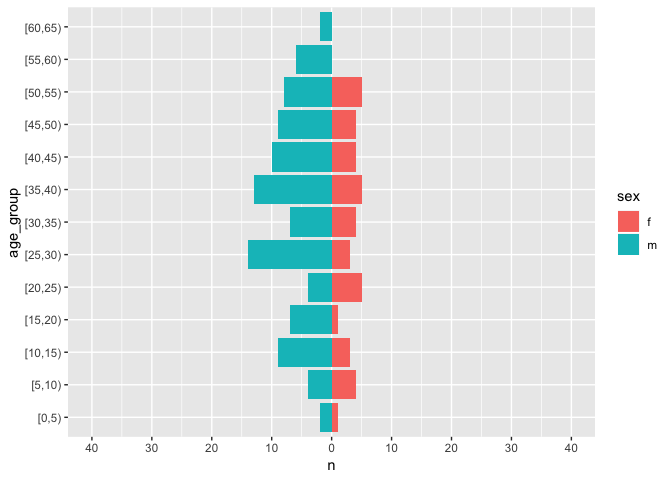

Mortality survey
================

Just a placeholder at the moment.

# Sample Size and Sampling methods

## Sample Size

``` r
size <- sample_size(population_size = 10000,
                    precision = 0.005, 
                    design_effect = 1.5, 
                    expected_prevalence = 0.005)
size
```

    ## [1] 1065

``` r
sample_size_households(size, 
                       avg_hh = 5, 
                       prop_under_5 = 0.15, 
                       frac_6_59 = 0.9, 
                       non_response_rate = 0.03)
```

    ## [1] 1627

## Sampling

### Random sampling

``` r
# Insert some code to generate a random number sequence
```

### Cluster sampling

``` r
# Insert some example code to do cluster sampling
```

# Study Findings

``` r
linelist <- outbreaks::fluH7N9_china_2013 %>% 
  group_by(province) %>% 
  filter(n() > 5) %>% 
  ungroup() %>% 
  filter(!is.na(outcome))

design <- svydesign(ids = ~1,  #no cluster within strata
                    strata = ~province, # strata
                    weights = ~ 1, # sampling weights
                    data = linelist)

# get totals
svytotal(~outcome, design)
```

    ##                total     SE
    ## outcomeDeath      27 3.9362
    ## outcomeRecover    35 3.9362

``` r
# compute something by another group. E.g. the mean
svyby(~outcome, ~gender, design, svymean)
```

    ##   gender outcomeDeath outcomeRecover se.outcomeDeath se.outcomeRecover
    ## f      f    0.3529412      0.6470588      0.11713818        0.11713818
    ## m      m    0.4651163      0.5348837      0.07686946        0.07686946

``` r
# you can also compute confidence intervals
confint(svyby(~outcome, ~gender, design, svymean))
```

    ##                      2.5 %    97.5 %
    ## f:outcomeDeath   0.1233546 0.5825278
    ## m:outcomeDeath   0.3144549 0.6157776
    ## f:outcomeRecover 0.4174722 0.8766454
    ## m:outcomeRecover 0.3842224 0.6855451

``` r
confint(svytotal(~outcome, design))
```

    ##                   2.5 %   97.5 %
    ## outcomeDeath   19.28526 34.71474
    ## outcomeRecover 27.28526 42.71474

## Demographics

``` r
linelist <- outbreaks::fluH7N9_china_2013 %>% 
  rename(sex = gender) %>% 
  mutate(age = as.integer(age)) %>%
  mutate(age_group = cut(age, breaks = seq(0, 90, 5), right = FALSE)) %>% 
  filter(!is.na(sex))

plot_age_pyramid(linelist)
```

<!-- -->
