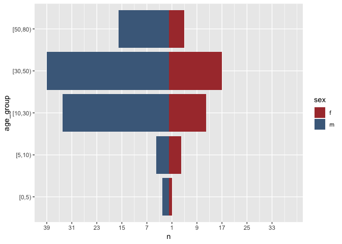
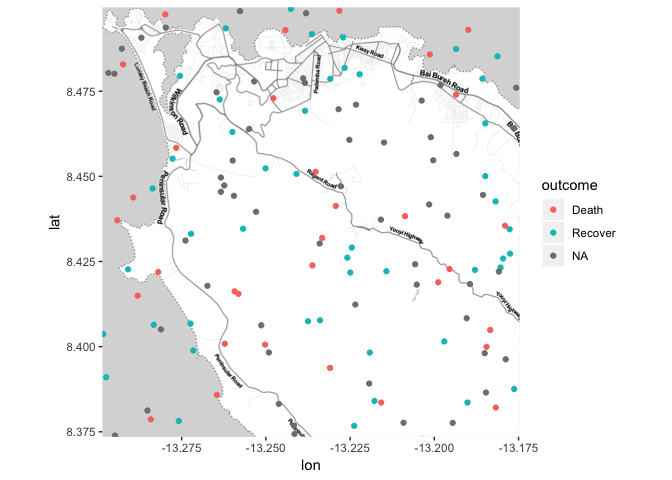
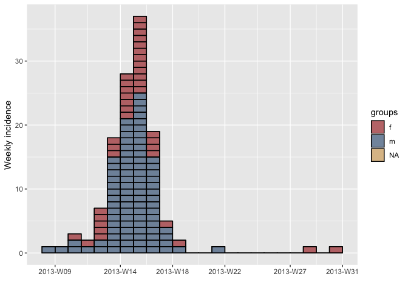

Outbreak report
================

This is a test document to gather functions and code snippets that
eventually will evolve into an outbreak report template (+ package(s)).

### Person

  - \[Who is affected: how many in total; male or female; young, adult
    or old? What are the links between affected people – work place,
    school, social gathering? Is there a high rate of illness in
    contacts? Is there a high rate of illness in health workers? You may
    want to include: a bar chart showing case numbers or incidence by
    age group and sex; attack rates (AR); and numbers of deaths (in
    suspected and confirmed cases), mortality rates and/or case fatality
    ratio (CFR)\]

#### Age

Cases by sex

| sex | cases |
| :-- | ----: |
| f   |    39 |
| m   |    95 |
| NA  |     2 |

Cases by age group

| age\_group | cases |
| :--------- | ----: |
| \[0,5)     |     5 |
| \[5,10)    |     8 |
| \[10,30)   |    46 |
| \[30,50)   |    56 |
| \[50,80)   |    21 |

Age pyramid

<!-- -->

CFR

| deaths | population |       cfr |     lower |     upper |
| -----: | ---------: | --------: | --------: | --------: |
|     32 |        136 | 0.2352941 | 0.1718861 | 0.3132451 |

CFR by age group

| age\_group | deaths | population |       cfr |     lower |     upper |
| :--------- | -----: | ---------: | --------: | --------: | --------: |
| \[50,80)   |      7 |         12 | 0.5833333 | 0.3195113 | 0.8067397 |
| \[30,50)   |     14 |         29 | 0.4827586 | 0.3138609 | 0.6556898 |
| \[10,30)   |      8 |         27 | 0.2962963 | 0.1585304 | 0.4848068 |
| \[5,10)    |      2 |          6 | 0.3333333 | 0.0967714 | 0.7000067 |
| \[0,5)     |      1 |          5 | 0.2000000 | 0.0362241 | 0.6244654 |

#### Attack rate

    ##   cases population cfr      lower     upper
    ## 1   136       1360 0.1 0.08516522 0.1170881

#### Mortality

Mortality rate per 100,000:

| deaths | population | mortality per 10 000 |    lower |    upper |
| -----: | ---------: | -------------------: | -------: | -------: |
|     32 |        136 |             2352.941 | 1718.861 | 3132.451 |

#### 2x2 tables

    ##          Outcome
    ## Predictor Death Recover
    ##         f     9      12
    ##         m    22      34

    ## $data
    ##          Outcome
    ## Predictor Death Recover Total
    ##     f         9      12    21
    ##     m        22      34    56
    ##     Total    31      46    77
    ## 
    ## $measure
    ##          risk ratio with 95% C.I.
    ## Predictor estimate     lower    upper
    ##         f   1.0000        NA       NA
    ##         m   1.0625 0.6938502 1.627017
    ## 
    ## $p.value
    ##          two-sided
    ## Predictor midp.exact fisher.exact chi.square
    ##         f         NA           NA         NA
    ##         m  0.7785528    0.7991337  0.9810788
    ## 
    ## $correction
    ## [1] TRUE
    ## 
    ## attr(,"method")
    ## [1] "Unconditional MLE & normal approximation (Wald) CI"

    ## $data
    ##          Outcome
    ## Predictor Death Recover Total
    ##     f         9      12    21
    ##     m        22      34    56
    ##     Total    31      46    77
    ## 
    ## $measure
    ##          odds ratio with 95% C.I.
    ## Predictor estimate     lower    upper
    ##         f 1.000000        NA       NA
    ##         m 1.159091 0.4191651 3.205161
    ## 
    ## $p.value
    ##          two-sided
    ## Predictor midp.exact fisher.exact chi.square
    ##         f         NA           NA         NA
    ##         m  0.7785528    0.7991337  0.9810788
    ## 
    ## $correction
    ## [1] TRUE
    ## 
    ## attr(,"method")
    ## [1] "Unconditional MLE & normal approximation (Wald) CI"

### Time

  - \[When did the cases fall ill? Are numbers increasing or stable? You
    may want to include an Epi curve (bar chart showing number of new
    (suspected and confirmed) cases each day/week) \]

<!-- end list -->

    ## 10 missing observations were removed.

<!-- -->

    ## 10 missing observations were removed.

<!-- -->

### Place

  - \[Across what area: one or several villages, all from same school,
    etc. You may want to include a map of the distribution of cases;
    attack rates by location\]

#### Quick and simple map with ggmap

Just WIP. Not sure if ggmap is a good
approach.

<!-- -->

#### Mortality rate per district

| Province | Number of cases | Population | Incidence per 1000 | Lower 95% CI | Upper 95% CI |
| :------- | --------------: | ---------: | -----------------: | -----------: | -----------: |
| Anhui    |               2 |      36474 |               0.05 |         0.02 |         0.20 |
| Beijing  |               0 |      37450 |               0.00 |         0.00 |         0.10 |
| Fujian   |               0 |      33968 |               0.00 |         0.00 |         0.11 |
| Hebei    |               1 |      26492 |               0.04 |         0.01 |         0.21 |
| Henan    |               1 |       9270 |               0.11 |         0.02 |         0.61 |
| Hunan    |               1 |      50269 |               0.02 |         0.00 |         0.11 |
| Jiangsu  |               4 |      96828 |               0.04 |         0.02 |         0.11 |
| Jiangxi  |               1 |       7086 |               0.14 |         0.02 |         0.80 |
| Shandong |               0 |       2275 |               0.00 |         0.00 |         1.69 |
| Shanghai |              16 |      32853 |               0.49 |         0.30 |         0.79 |
| Zhejiang |               6 |      46222 |               0.13 |         0.06 |         0.28 |
