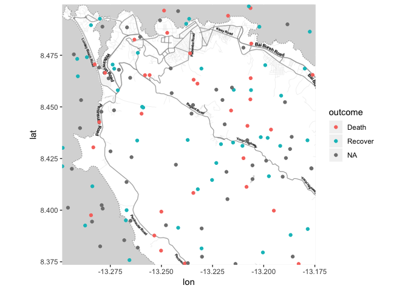

Outbreak report
================

This is a test document to gather functions and code snippets that
eventually will evolve into an outbreak report template (+ package(s)).

### Person

  - \[Who is affected: how many in total; male or female; young, adult
    or old? What are the links between affected people – work place,
    school, social gathering? Is there a high rate of illness in
    contacts? Is there a high rate of illness in health workers? You may
    want to include: a bar chart showing case numbers or incidence by
    age group and sex; attack rates (AR); and numbers of deaths (in
    suspected and confirmed cases), mortality rates and/or case fatality
    ratio (CFR)\]

In total there were 136 cases. There were 39 females affected and 95
males.

The most affected age group was 30-49 years.

#### Age

Cases by sex

| sex    |  n | prop |
| :----- | -: | ---: |
| Female | 39 | 28.7 |
| Male   | 95 | 69.9 |
| NA     |  2 |  1.5 |

Cases by age group

| age\_group |  n | prop |
| :--------- | -: | ---: |
| 0-4        |  5 |  3.7 |
| 5-9        |  8 |  5.9 |
| 10-29      | 46 | 33.8 |
| 30-49      | 56 | 41.2 |
| 50-79      | 21 | 15.4 |

Cases by age group and
definition

| age\_group | Confirmed\_n | Confirmed\_prop | Possible\_n | Possible\_prop | Probable\_n | Probable\_prop |
| :--------- | -----------: | --------------: | ----------: | -------------: | ----------: | -------------: |
| 0-4        |            1 |             1.6 |           2 |            5.7 |           2 |            5.3 |
| 5-9        |            4 |             6.3 |           1 |            2.9 |           3 |            7.9 |
| 10-29      |           20 |            31.7 |          15 |           42.9 |          11 |           28.9 |
| 30-49      |           28 |            44.4 |          13 |           37.1 |          15 |           39.5 |
| 50-79      |           10 |            15.9 |           4 |           11.4 |           7 |           18.4 |

Cases by age group and
sex

| age\_group | Female\_n | Female\_prop | Male\_n | Male\_prop | NA\_n | NA\_prop |
| :--------- | --------: | -----------: | ------: | ---------: | ----: | -------: |
| 0-4        |         1 |          2.6 |       2 |        2.1 |     2 |      100 |
| 5-9        |         4 |         10.3 |       4 |        4.2 |     0 |        0 |
| 10-29      |        12 |         30.8 |      34 |       35.8 |     0 |        0 |
| 30-49      |        17 |         43.6 |      39 |       41.1 |     0 |        0 |
| 50-79      |         5 |         12.8 |      16 |       16.8 |     0 |        0 |

Age pyramid

<!-- -->

CFR

| deaths | population |  cfr | lower | upper |
| -----: | ---------: | ---: | ----: | ----: |
|     32 |        136 | 23.5 |  17.2 |  31.3 |

CFR by age group

| age\_group | deaths | population |  cfr | lower | upper |
| :--------- | -----: | ---------: | ---: | ----: | ----: |
| 50-79      |      7 |         12 | 58.3 |  32.0 |  80.7 |
| 30-49      |     14 |         29 | 48.3 |  31.4 |  65.6 |
| 10-29      |      8 |         27 | 29.6 |  15.9 |  48.5 |
| 5-9        |      2 |          6 | 33.3 |   9.7 |  70.0 |
| 0-4        |      1 |          5 | 20.0 |   3.6 |  62.4 |

#### Attack rate

| cases | population | ar | lower | upper |
| ----: | ---------: | -: | ----: | ----: |
|   136 |       1360 | 10 |   8.5 |  11.7 |

ADD ATTACK RATE BY WEEK\!\!\!\!\!

Cummulative attack week as weeks go on and one that is sepereate counts
for each week

#### Mortality

Mortality rate per 100,000:

| deaths | population | mortality per 10 000 |  lower |  upper |
| -----: | ---------: | -------------------: | -----: | -----: |
|     32 |        136 |               2352.9 | 1718.9 | 3132.5 |

#### 2x2 tables

    ## Warning in univariate_analysis(outcome, is_male, is_child): Removed 2 rows
    ## due to missing values

| exposure  | exp | exp\_cases | exp\_AR | unexp | unexp\_cases | unexp\_AR |  estimate |     lower |    upper |  p\_value |
| :-------- | --: | ---------: | ------: | ----: | -----------: | --------: | --------: | --------: | -------: | --------: |
| is\_male  |  56 |         22 |     0.4 |    46 |           34 |       0.7 | 0.9601518 | 0.7233926 | 1.274400 | 0.7785528 |
| is\_child |  14 |          3 |     0.2 |    46 |           11 |       0.2 | 0.4046921 | 0.1227969 | 1.333712 | 0.1225535 |

### Time

  - \[When did the cases fall ill? Are numbers increasing or stable? You
    may want to include an Epi curve (bar chart showing number of new
    (suspected and confirmed) cases each day/week) \]

There were 10 cases missing dates of onset.

The peak of the outbreak was in 2013-W15.

<!-- -->

You may also want to stratify by gender.

<!-- -->

### Place

  - \[Across what area: one or several villages, all from same school,
    etc. You may want to include a map of the distribution of cases;
    attack rates by location\]

#### Quick and simple map with ggmap

Just WIP. Not sure if ggmap is a good approach.

DO THIS WITH ALL OF CHINA FOR A CHOROPLETH USING GADM SHAPEFILES ALSO
GET OSM TILES AND
DATA

<!-- -->

#### Mortality rate per district

| Province | Number of cases | Population | Incidence per 1000 | Lower 95% CI | Upper 95% CI |
| :------- | --------------: | ---------: | -----------------: | -----------: | -----------: |
| Anhui    |               2 |       7038 |               0.28 |         0.08 |         1.04 |
| Beijing  |               0 |      55894 |               0.00 |         0.00 |         0.07 |
| Fujian   |               0 |      91268 |               0.00 |         0.00 |         0.04 |
| Hebei    |               1 |       7567 |               0.13 |         0.02 |         0.75 |
| Henan    |               1 |      62594 |               0.02 |         0.00 |         0.09 |
| Hunan    |               1 |      64220 |               0.02 |         0.00 |         0.09 |
| Jiangsu  |               4 |      63452 |               0.06 |         0.02 |         0.16 |
| Jiangxi  |               1 |       9022 |               0.11 |         0.02 |         0.63 |
| Shandong |               0 |      96648 |               0.00 |         0.00 |         0.04 |
| Shanghai |              16 |      96668 |               0.17 |         0.10 |         0.27 |
| Zhejiang |               6 |      82173 |               0.07 |         0.03 |         0.16 |
