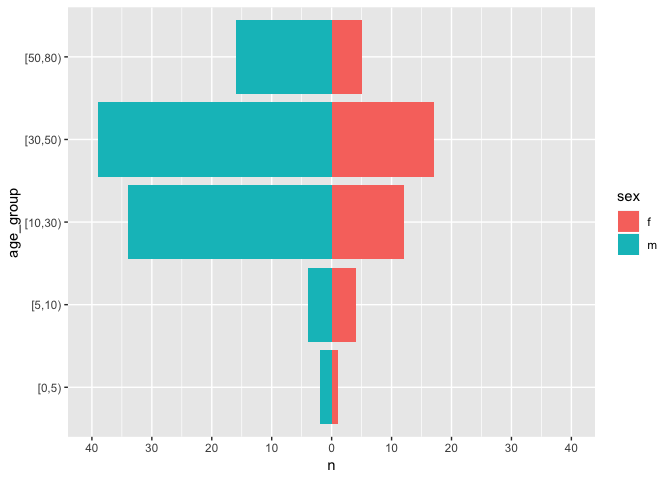
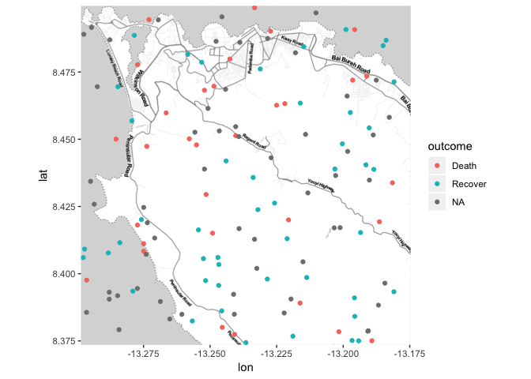

Outbreak report
================

This is a test document to gather functions and code snippets that
eventually will evolve into an outbreak report template (+ package(s)).

``` r
# as a starting point
linelist <- outbreaks::fluH7N9_china_2013
```

### Data preparation

``` r
linelist_cleaned <- linelist %>%
  rename(sex = gender) %>% 
  mutate(age = as.integer(age)) %>%
  mutate(age_group = cut(age, breaks = c(0, 5, 10, 30, 50, 80), right = FALSE))
```

### Person

  - \[Who is affected: how many in total; male or female; young, adult
    or old? What are the links between affected people – work place,
    school, social gathering? Is there a high rate of illness in
    contacts? Is there a high rate of illness in health workers? You may
    want to include: a bar chart showing case numbers or incidence by
    age group and sex; attack rates (AR); and numbers of deaths (in
    suspected and confirmed cases), mortality rates and/or case fatality
    ratio (CFR)\]

#### Age

Cases by sex

``` r
linelist_cleaned %>%
  group_by(sex) %>%
  summarise(cases = n()) %>%
  kable()
```

| sex | cases |
| :-- | ----: |
| f   |    39 |
| m   |    95 |
| NA  |     2 |

Cases by age group

``` r
linelist_cleaned %>%
  group_by(age_group) %>%
  summarise(cases = n()) %>%
  kable()
```

| age\_group | cases |
| :--------- | ----: |
| \[0,5)     |     5 |
| \[5,10)    |     8 |
| \[10,30)   |    46 |
| \[30,50)   |    56 |
| \[50,80)   |    21 |

Age pyramid

``` r
by_age <- group_by(linelist_cleaned, age_group, sex) %>%
  filter(!is.na(sex)) %>%
  summarise(n = n()) %>%
  mutate(n = ifelse(sex == "m", -1, 1) * n)

plot_age_pyramid(by_age)
```

<!-- -->

CFR

``` r
known_status <- linelist_cleaned[!is.na(linelist_cleaned$outcome), ]
deaths <- sum(known_status$outcome == "Death")
population <- length(linelist_cleaned$outcome)
```

``` r
case_fatality_rate(deaths, population) %>% knitr::kable()
```

| deaths | population |       cfr |     lower |     upper |
| -----: | ---------: | --------: | --------: | --------: |
|     32 |        136 | 0.2352941 | 0.1718861 | 0.3132451 |

CFR by age group

``` r
group_by(known_status, age_group) %>%
  do({
    deaths <- sum(.$outcome == "Death")
    population <- length(.$outcome)
    case_fatality_rate(deaths, population)
  }) %>%
  arrange(desc(lower)) %>%
  knitr::kable()
```

| age\_group | deaths | population |       cfr |     lower |     upper |
| :--------- | -----: | ---------: | --------: | --------: | --------: |
| \[50,80)   |      7 |         12 | 0.5833333 | 0.3195113 | 0.8067397 |
| \[30,50)   |     14 |         29 | 0.4827586 | 0.3138609 | 0.6556898 |
| \[10,30)   |      8 |         27 | 0.2962963 | 0.1585304 | 0.4848068 |
| \[5,10)    |      2 |          6 | 0.3333333 | 0.0967714 | 0.7000067 |
| \[0,5)     |      1 |          5 | 0.2000000 | 0.0362241 | 0.6244654 |

#### Mortality

Mortality rate per 100,000:

``` r
mortality_rate(deaths, population, multiplier = 10^4) %>%
  kable()
```

| deaths | population | mortality per 10 000 |    lower |    upper |
| -----: | ---------: | -------------------: | -------: | -------: |
|     32 |        136 |             2352.941 | 1718.861 | 3132.451 |

### Time

  - \[When did the cases fall ill? Are numbers increasing or stable? You
    may want to include an Epi curve (bar chart showing number of new
    (suspected and confirmed) cases each day/week) \]

<!-- end list -->

``` r
inc_week_7 <- incidence(linelist_cleaned$date_of_onset, interval = 7)
```

    ## 10 missing observations were removed.

``` r
plot(inc_week_7, show_cases = TRUE, border = "black")
```

<!-- -->

``` r
inc_week_7 <- incidence(linelist_cleaned$date_of_onset, 
                        interval = 7, 
                        groups = linelist_cleaned$sex)
```

    ## 10 missing observations were removed.

``` r
plot(inc_week_7, show_cases = TRUE, border = "black")
```

<!-- -->

### Place

  - \[Across what area: one or several villages, all from same school,
    etc. You may want to include a map of the distribution of cases;
    attack rates by location\]

#### Quick and simple map with ggmap

Just WIP. Not sure if ggmap is a good approach.

``` r
bb <- osmdata::getbb("Western Area Urban, Sierra Leone")

# generate artificual coords

ll_geo <- linelist_cleaned %>% 
  mutate(Longitude = runif(nrow(linelist_cleaned), bb[1, 1], bb[1, 2]),
         Latitude = runif(nrow(linelist_cleaned), bb[2, 1], bb[2, 2]))

library(ggmap)
b <- get_map(as.numeric(bb), maptype="toner-lite", source="stamen")
ggmap(b) + 
  geom_point(data = ll_geo, aes(x = Longitude, y = Latitude, color = outcome))
```

<!-- -->

#### Mortality rate per district

``` r
# let's generate some artificial population data
population <- distinct(linelist_cleaned, province)
population$population <- as.integer(runif(nrow(population), min = 10^3, max = 10^5))

linelist_cleaned %>%
  filter(!is.na(outcome)) %>%
  group_by(province) %>%
  do({
    province <- as.character(.$province[1])
    deaths <- sum(.$outcome == "Death")
    pop <- population[population$province == province, "population"]
    mortality_rate(deaths, pop, multiplier = 10^3)
  }) %>%
  mutate_if(is.numeric, funs(round(., digits = 2))) %>%
  kable(col.names = c("Province", "Number of cases", "Population",
                      "Incidence per 1000", "Lower 95% CI", "Upper 95% CI"))
```

| Province | Number of cases | Population | Incidence per 1000 | Lower 95% CI | Upper 95% CI |
| :------- | --------------: | ---------: | -----------------: | -----------: | -----------: |
| Anhui    |               2 |      45382 |               0.04 |         0.01 |         0.16 |
| Beijing  |               0 |      34583 |               0.00 |         0.00 |         0.11 |
| Fujian   |               0 |      62671 |               0.00 |         0.00 |         0.06 |
| Hebei    |               1 |      84527 |               0.01 |         0.00 |         0.07 |
| Henan    |               1 |      83064 |               0.01 |         0.00 |         0.07 |
| Hunan    |               1 |      10128 |               0.10 |         0.02 |         0.56 |
| Jiangsu  |               4 |      51647 |               0.08 |         0.03 |         0.20 |
| Jiangxi  |               1 |      18794 |               0.05 |         0.01 |         0.30 |
| Shandong |               0 |      28045 |               0.00 |         0.00 |         0.14 |
| Shanghai |              16 |      88120 |               0.18 |         0.11 |         0.29 |
| Zhejiang |               6 |       3994 |               1.50 |         0.69 |         3.27 |
