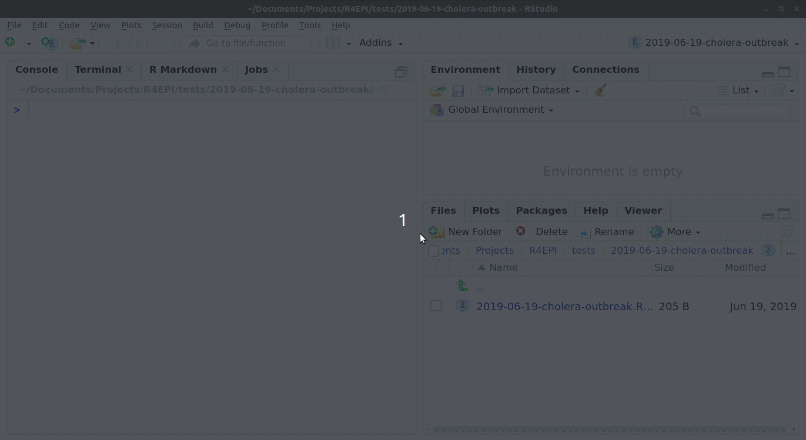
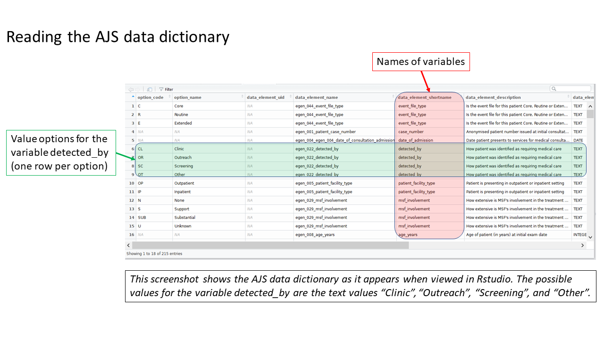
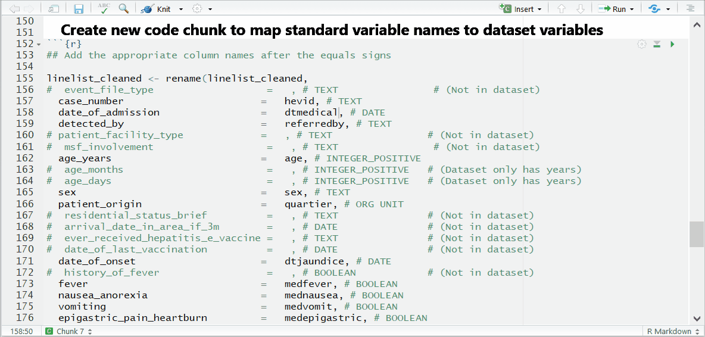
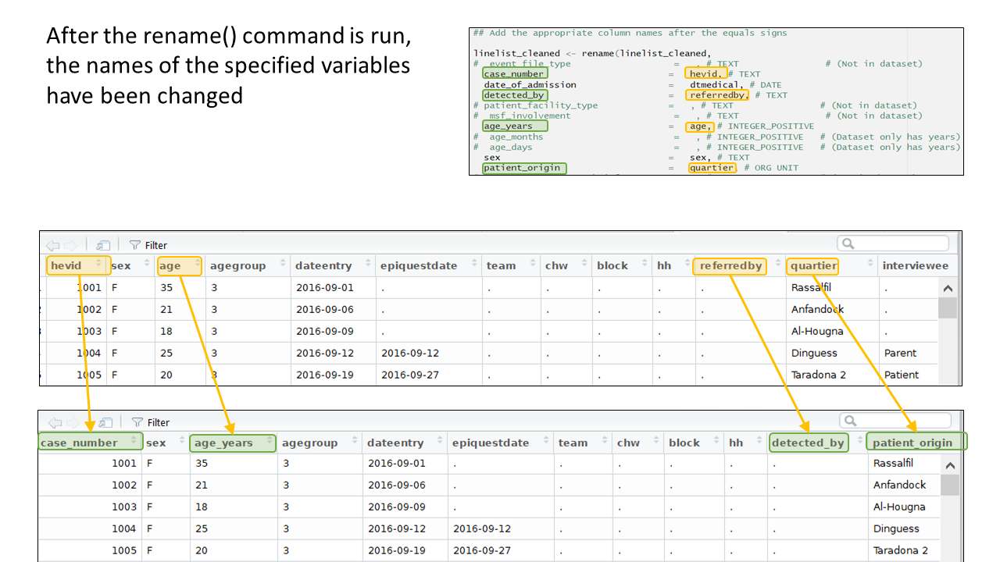
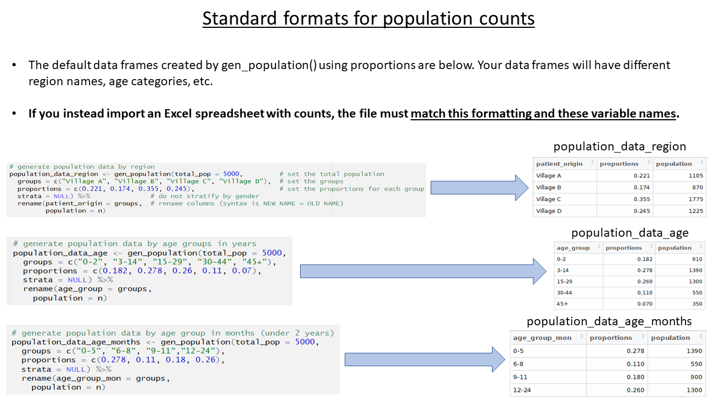

```{r, include = FALSE}
knitr::opts_chunk$set(
  warning = FALSE,
  message = FALSE,
  collapse = TRUE,
  comment = "#>",
  echo = TRUE
)
```

## Overview

This page demonstrate use of the {sitrep} R Markdown template for analysis of an outbreak of Acute Jaundice Syndrome (AJS), using data from an outbreak in Am Timan, Chad. *This case study uses data that is not standardized with the MSF data dictionary, and so reflects a challenging use case.*

### AJS/HEV outbreak in Am Timan, Chad (2016-2017)

We will be using data and examples from a real outbreak of Hepatitis E virus (HEV) infection which occurred in the Chadian town of Am Timan between October 2016 and April 2017

*DISCLAIMER: The real data from the outbreak has been used for the training materials linked to the outbreak templates of the R4epis project. The Chadian Ministry of Health (MoH) has approved the use of this data for training purposes. Please note, that some data has been adapted in order to best achieve training objectives. Also, the GPS coordinates included in the dataset do not correspond to real cases identified during this outbreak. They have been generated exclusively for training purposes.*

In early September 2016, a cluster of severely ill pregnant women with jaundice was detected at the Am Timan Hospital in the maternity ward. Following rapid tests conducted in Am Timan and confirmatory testing in the Netherlands, this was confirmed as due to HEV infection. Thus the MoH and MSF outbreak response was activated.

The response consisted of four components:

1)  active community based surveillance (CBS)\
2)  clinical assessment and management of ill cases at the hospital\
3)  water chlorination activities at most water points in the town\
4)  hygiene promotion

**The outbreak linelist data was combined data from the active CBS data and the clinical data from the hospital.** The CBS functioned with community health workers visiting all households in the town every two weeks and actively searching for people with Acute Jaundice Syndrome (AJS). For this group of persons (suspected cases), only those that were visibly ill or that were pregnant were referred to the hospital for clinical assessment and admission if required. Persons that self-reported to the hospital or that arrived after referral would undergo a clinical assessment and a rapid test for HEV for diagnosis. Thus only for people assessed at the hospital were we able to capture a confirmed case status.

For the duration of the outbreak we detected 1193 suspected cases, 100 confirmed cases and discarded 150 cases with AJS who were not positive for HEV infection.

[Link to Spina and Lenglet *et al.* 2017](https://journals.plos.org/plosone/article?id=10.1371/journal.pone.0188240)

## Getting started

### Software installations

To begin using R, ensure you have the following free software installed:

1.  [R](https://cran.r-project.org/bin/windows/base/) (the free statistical software)
2.  [RStudio](https://www.rstudio.com/products/rstudio/download/#download) (the free user interface)
3.  [RTools](https://cran.r-project.org/bin/windows/Rtools/) (only needed for Windows computers)

If you are a new R user, we highly suggest doing the following before beginning to use these templates:

1.  Complete our 5 free online introductory [R tutorials](www.appliedepi.org/tutorial). To begin, create your free Applied Epi account, as explained in the linked page
2.  Review the [R basics chapter](https://epirhandbook.com/en/r-basics.html#r-basics) of our Epidemiologist R Handbook
3.  Review the [Reports with R Markdown chapter](https://epirhandbook.com/en/reports-with-r-markdown.html) of the Epidemiologist R Handbook

Once you have an understanding of how R and RStudio work, know how to run basic commands, have practiced running R code on your computer, and have read about R Markdown reports, then you are ready to use our {sitrep} R Markdown templates to produce situation reports.

### Install the {sitrep} R package

To access the templates, you must install the "sitrep" R package. R packages are often written in text with curly brackets, like this: {sitrep}

1.  Open RStudio
2.  Run the following command in the R Console pane:

```{r, eval=FALSE, echo=TRUE}
# install the {remotes} package, which is used to install the {sitrep} package
install.packages("remotes")
```

3.  Now run this command, also in the R Console pane. The {sitrep} package is currently available from a location on Github, a site to store and share code.

```{r, eval=FALSE, echo=TRUE}
# use {remotes} to install {sitrep} from Github
remotes::install_github("R4EPI/sitrep", dependencies = TRUE)
```

### Download the solution to follow along

We suggest that you [Download the "solution" R Markdown template](/public_data/Final_casestudy_AJS_template.Rmd) used in this vignette, in order to follow-along step-by-step.

### Open a new RStudio project

Working in R is best done from within an "RStudio project" that contains all the datasets, R scripts, and outputs for a single analytical project.

You should review the Epidemiologist R Handbook chapters on [RStudio projects](https://epirhandbook.com/en/r-projects.html). Below are brief instructions on how to create a new RStudio project:

> Select *File -\> New Project* from the top RStudio menu.

> Creating a new R project will create:

> -   A new project directory (folder)\
> -   A R project file (.Rproj) in the project folder that serves as a shortcut to open the project via RStudio

> Note:

> -   You can make sub-folders for data, scripts, etc.\
> -   All files produced by R scripts saved to the project will also save into the project folder\
> -   Navigate and open project files, such as scripts, using the Files tab of the lower-right RStudio pane.\
>     \*For an RMarkdown to produce the final report correctly, you must have read/write permissions for the location of the R project folder. On an MSF computer this is generally the c:/temp folder.

One significant benefit of working within an R project is that all associated files (datasets, etc.) are located within the same folder. Thus, to send the project to someone else, **simply zip the folder and send**. All files referenced in the scripts are included and if you utilized the {here} package, no file paths are unique to your computer.

## Open a {sitrep} R Markdown template

For this vignette, you will need to open the template for "AJS" (Acute Jaundice Syndrome). See the instructions and GIF below.

### Opening a template

1.  Ensure you have installed the {sitrep} package as detailed above\
2.  Go to the File menu, select "New File", and select "R Markdown"\
3.  In the pop-up window, select "From template"
4.  From the list of templates, select "AJS Outbreak Report" - the template will open in RStudio\
5.  Go to File, "Save", and write a name for this R Markdown script; save it into your RStudio Project folder

{width="549"} \### Folder structure

It is highly recommended that you store your R Markdown script and any data used in the same folder (the RStudio project). You should review the Epidemiologist R Handbook chapters on [RStudio projects](https://epirhandbook.com/en/r-projects.html).

## Become familiar with the template

### Header

The very top of the R Markdown template consists of a header surrounded by `---` lines. This is called the "YAML" header, in which you can edit the title of your document. The other settings in the header define the default document type produced (Microsoft Word) when the RMarkdown is "knit".


### Introduction to the template

This text just below the header is for your reference only. If left alone it will appear at the beginning of your report, so you should replace it with a more relevant introduction. Any text you write here can be formatted with *italics*, **bold**, bullets, numbers, tables, and in-line code. See this [RMarkdown cheatsheet](/images/rmarkdown_cheatsheet_2.0.pdf) for tips on formatting.

### Explanatory text

Green text located between these special characters (`<!--` and `-->`), is for your information only. This text will **not** appear in the final Word document report.

## Installing and loading packages

```{r, eval=TRUE, echo=FALSE}
# Install and load required packages for this template
pacman::p_load(
  knitr,           # create output docs
  here,            # find your files
  rio,             # read in data
  forcats,         # handle ordinal columns
  lubridate,       # handle dates
  dplyr,           # clean/shape data
  tidyr,           # clean/shape data
  stringr,         # clean text
  ggplot2,         # create plots and charts
  slider,          # moving averages
  parsedate,       # guessing dates
  patchwork,       # combine multiple plots
  sitrep,          # MSF field epi functions
  epitabulate,     # helper functions
  janitor,         # clean data
  matchmaker,      # matching data
  gtsummary,       # tables
  flextable,
  tsibble,         # epiweeks
  sf,              # encode spatial vector data
  ggspatial,       # plot maps
  purrr            # iterate over data
)
```


**The first code chunk, `setup`, is very important and must be kept.** When the final report is knit, this chunk will run without producing any output, but it is required for the template to work correctly.

This `setup` code chunk does the following:

-   Set default settings for tables such as size, error handling, and display of missing values

-   Run a command using the {pacman} package to install and load the R packages that are used in this template.

-   Set default text size in graphic plots

-   Establish visual theme settings for epidemic curve plots

### About the packages used in this template

#### Generic packages

| R package   | Use                                                                        |
|-------------|----------------------------------------------------------------------------|
| {knitr}     | to create the output document (pdf, doc, html)                             |
| {here}      | to locate files within the RStudio project                                 |
| {rio}       | to import data from various formats (csv, xlsx, tsv, etc.)                 |
| {dplyr}     | to clean and handle data                                                   |
| {forcats}   | to clean the data and create ordinal columns ("factors")                 |
| {stringr}   | to clean and handle text/characters (known as "strings")                   |
| {ggplot2}   | to visualise your data in plots                                            |
| {lubridate} | to handle dates and times                                                  |
| {gtsummary} | to produce summary tables                                                  |
| {flextable} | to format summary tables for presentation                                  |
| {purrr}     | to iterate processes - repeating the same process many times with small variations |

#### More epidemiology-specific packages

| R package            | Use                                                                |
|----------------------|--------------------------------------------------------------------|
| {sitrep}             | includes the templates and functions useful for field epidemiology |
| {slider}             | to calculate moving averages                                       |
| {parsedate}          | to interpret "messy" date formats                              |
| {matchmaker}         | to clean data using data dictionaries                                 |
| {tsibble}            | to conduct time-series analysis, and produce epidemiological weeks      |
| {sf} and {ggspatial} | to produce maps                                                 |


## Define the report settings  
Typically, near the top of a report you establish settings that will be used throughout the report.  

### Define the reporting date
This chunk continues the set-up of time-related parameters. There are potentially two items to edit in this chunk:  

1. Set the `reporting_date` object to the latest date for data to be used in your report. This value is used in later code chunks, for example when producing epidemic curves. Follow the format in the code: `ymd("YYYY-MM-DD")`

```{r, eval=TRUE, echo=TRUE}
reporting_date <- ymd("2018-04-23")
```

*If you want to use the current date (as per your computer) which will be automatically updated, place `Sys.Date()` within the `ymd()` function, like this: `ymd(Sys.Date())`. Or try, `ymd(Sys.Date()-3)`.*  


### Define the current week

2. Adjust whether your epidemiological weeks begin on Mondays, Sundays, etc. The second command in this code chunk creates the object `reporting_week` using the `report_date` object from the above command.  

*The only part of this command that you may need to change is the number near the end*. Use `1` for Mondays, or `7` for Sundays.  

```{r, eval=TRUE, echo=TRUE}
reporting_week <- tsibble::yearweek(reporting_date, 1)
```


### Set plot defaults  

In this next chunk, you define the labels that will be used in epidemic curve plots. This code should not need any adjustment. 

You may notice that the `subtitle = ` label uses the object `reporting_week` in curly braces - this means that the value of `reporting_week` defined in the previous chunk will show in its place.  

```{r, echo=FALSE, eval=TRUE}
ggplot2::theme_set(theme_classic(base_size = 18))

## sets the theme in ggplot for epicurves
epicurve_theme <- theme(
  axis.text.x = element_text(angle = 45, hjust = 1, vjust = 1), 
  legend.title = element_blank(),
  legend.position = "bottom",
  panel.grid.major.x = element_line(color = "grey60", linetype = 3),
  panel.grid.major.y = element_line(color = "grey60", linetype = 3))
```


```{r echo=TRUE}
## sets the labels in ggplot for the epicurves
epicurve_labels <- labs(x = "Calendar week", 
                        y = "Cases (n)", 
                        title = "Cases by week of onset",
                        subtitle = str_glue("Source: MSF data from {reporting_week}")
                       ) 
```


## Import data

This {sitrep} template offers three (3) dataset options:  

1. Generating a fake linelist for practice  
2. Using standardised DHIS2 data  
3. Using non-standard data

Ensure that you use the code chunks for your situation, and either delete or commend out (using \#) the code for the other scenarios.  

{width="549"} 

### Import data for this vignette  

**This vignette will demonstrate using *non-standard data***. The data are stored in the {sitrep} R package and can be accessed by running these commands:  

```{r, echo=TRUE}
# load the sitrep package
library(sitrep)

# access the case linelist dataset for this vignette and store in your R Environment for use
linelist_raw <- AJS_linelist    
```

For this vignette, **comment out (using \#) or delete the `read_fake_data`, `read_DHIS_data`, and `prep_DHIS_data` chunks**, as they are not necessary and will cause errors.

A successful import should result in a dataframe object named `linelist_raw` in your RStudio Environment pane, consisting of 1447 observations and 122 columns.

{width="549"}

### General data import tips

In your real-life situations, you will store your datasets (e.g. .xlsx or .csv in the RStudio project folder, and import them using `import()` and `here()`, as described in the Epidemiologist R Handbook's [Import and export](https://epirhandbook.com/en/import-and-export.html) chapter.

For non-DHIS2 datasets, you would import using the `read_nonDHIS_data` code chunk. The `import()` function of the {rio} package imports an Excel file that is not password protected, and is stored in a "Data" subfolder of the RStudio project. The `which = ` argument of `import()` specifies that the sheet "linelist" should be imported. You would edit this command as appropriate for your situation.  

```{r echo=TRUE, eval=FALSE}
# example code for importing data from an Excel file saved in RStudio project
# tThis imports a specific sheet, named "Sheet1"
linelist_raw <- rio::import(here::here("Data", "linelist.xlsx"), which = "Sheet1")
```


## Align columns with data dictionary  

As in this vignette, if your dataset is not initially aligned with the MSF data dictionary, the column names and values must be standardised. This is because later parts of the template expect certain column names and values.  

**This process can take some time** and requires looking back-and-forth between your dataset, RStudio, and the MSF data dictionary. In this vignette, here are the steps taken:  


### Review the MSF data dictionary

Uncomment and run this command, found in the `prep_nonDHIS_data` chunk, to view the MSF data dictionary for the specific disease ("AJS" in this example).

```{r eval = FALSE}
# Creates object linelist_dict using the msf_dict function from the sitrep package
linelist_dict <- msf_dict("AJS", compact = FALSE) %>%
  select(option_code, option_name, everything())
```

The dataframe `linelist_dict` should appear in your Environment pane. You can view the data dictionary by clicking on `linelist_dict` in the Environment pane, or running the command `View(linelist_dict)` (note capital V).  

{width="549"}

### Clean the column names

These steps standardize how your column names are written, such as changing spaces and dots to underscores ("_"). **Uncomment these lines of code in the `prep_nonDHIS_data` chunk**.  

**First, make a copy of the dataframe `linelist_raw` but with a new name: `linelist_cleaned`.**  
Throughout the template you will modify and improve this `linelist_cleaned` dataframe. However, you can always return to the `linelist_raw` version for reference.  

```{r, echo=TRUE}
## make a copy of your orginal dataset and name it linelist_cleaned
linelist_cleaned <- linelist_raw
```

**Second, use the `clean_names()` function** from the {janitor} package to fix any column names with non-standard syntax.

```{r, echo=TRUE, eval=TRUE}
linelist_cleaned <- janitor::clean_names(linelist_cleaned)
```


### Match your dataset's columns to MSF's AJS data dictionary  

Standardized column names are required for this template to work smoothly, and the column names in the Am Timan linelist do not align with the names this template expects.  

We need to change many column names, so we have developed a special function to help map our columns to the expected column names. The template also offers code that you can un-comment if there are only a few column names to change.  
This is done by un-commenting and running a command found in near the end of the chunk `prep_nonDHIS_data`. We run the command `msf_dict_rename_helper()` with "AJS" to get the correct helper for this template.

```{r eval = FALSE, warning = FALSE, message = FALSE}
msf_dict_rename_helper("AJS")
```

Running this command copies a block of code text to our clipboard. Now, *paste* from your clipboard into the template in the bottom of the code chunk. For the AJS template, the code that is pasted will look like the code below. This code uses the function `rename()` to change column names.  

*Be sure to paste the AJS rename helper code into an existing R code chunk (e.g. the bottom of `prep_nonDHIS_data`), not into the white space of the RMarkdown script.*

{width="549"}

#### Complete the mapping of column names

The columns will be in alphabetical order, sorted by if the appear in the template (REQUIRED) or not (optional).

Some columns---such as lab results or symptoms---are listed as REQUIRED, but are not absolutely necessary for the template to run. If you do not have a column and are unsure if it's necessary, do a search in the template to see if it's marked as OPTIONAL in the code chunk.

To the right of each equals sign, and before each comma, type the *exact* names of the columns from your dataset that correspond to the expected MSF data dictionary columns on the left. The last un-commented line should not have a comma at the end. 

Be sure to comment (#, ctrl + shift + c) out the lines of each data dictionary column in the helper that is not present in your dataset!


{width="549"}

If you see this error:  
`Error in is_symbol(expr) : argument "expr" is missing, with no default`  
then you likely forgot to comment (#) the line for a column you did not use.

And now you can see the result:  

{width="549"}


Below is the code for the column assignments used in this case study walk-through. You can copy or reference this when building your template for this vignette.  

```{r, echo=TRUE}
## Below are the column assignments used in this case study example

linelist_cleaned <- rename(linelist_cleaned,
  # age_days                          =   , # INTEGER_POSITIVE  (Dataset only has years)
  # age_months                        =   , # INTEGER_POSITIVE  (Dataset only has years)
  age_years                         = age, # INTEGER_POSITIVE  (REQUIRED)
  bleeding                          = medbleeding, # BOOLEAN           (REQUIRED)
  case_number                       = hevid, # TEXT              (REQUIRED)
  chikungunya_onyongnyong           = chik, # TEXT              (REQUIRED)
  # convulsions                       =   , # BOOLEAN           (Not in dataset)
  date_of_consultation_admission    = dtmedical, # DATE              (REQUIRED)
  # date_of_exit                      =   , # DATE              (Not in dataset)
  date_of_onset                     = dtjaundice, # DATE              (REQUIRED)
  dengue                            = dengue, # TEXT              (REQUIRED)
  # dengue_rdt                        =   , # TEXT              (Not in dataset)
  diarrhoea                         = meddiar, # BOOLEAN           (REQUIRED)
  # ebola_marburg                     =   , # TEXT              (Not in dataset)
  epigastric_pain_heartburn         = medepigastric, # BOOLEAN           (REQUIRED)
  exit_status                       = outcomehp, # TEXT              (REQUIRED)
  fever                             = medfever, # BOOLEAN           (REQUIRED)
  generalized_itch                  = meditching, # BOOLEAN           (REQUIRED)
  headache                          = medheadache, # BOOLEAN           (REQUIRED)
  hep_b_rdt                         = medhepb, # TEXT              (REQUIRED)
  hep_c_rdt                         = medhepc, # TEXT              (REQUIRED)
  hep_e_rdt                         = medhevrdt, # TEXT              (REQUIRED)
  # history_of_fever                  =   , # BOOLEAN           (Not in dataset)
  joint_pains                       = medarthralgia, # BOOLEAN           (REQUIRED)
  # lassa_fever                       =   , # TEXT              (Not in dataset)
  # malaria_blood_film                =   , # TEXT              (Not in dataset)
  malaria_rdt_at_admission          = medmalrdt, # TEXT              (REQUIRED)
  mental_state                      = medmental, # BOOLEAN           (REQUIRED)
  nausea_anorexia                   = mednausea, # BOOLEAN           (REQUIRED)
  other_arthropod_transmitted_virus = arbovpcr, # TEXT              (REQUIRED)
  other_cases_in_hh                 = medothhhajs, # BOOLEAN           (REQUIRED)
  # other_pathogen                    =   , # TEXT              (Not in dataset)
  other_symptoms                    = medother, # BOOLEAN           (REQUIRED)
  patient_facility_type             = hospitalised, # TEXT              (REQUIRED)
  patient_origin                    = quartier, # ORG UNIT          (REQUIRED)
  sex                               = sex, # TEXT              (REQUIRED)
  test_hepatitis_a                  = medhavelisa, # TEXT          (REQUIRED)
  test_hepatitis_b                  = medhbvelisa, # TEXT          (REQUIRED)
  test_hepatitis_c                  = medhcvelisa, # TEXT          (REQUIRED)
  test_hepatitis_e_genotype         = hevgenotype, # TEXT          (REQUIRED)
  # test_hepatitis_e_igg              =   , # TEXT              (In same column as elisa result)
  test_hepatitis_e_igm              = hevrecent, # TEXT          (REQUIRED)
  test_hepatitis_e_virus            = medhevelisa, # TEXT          (REQUIRED)
  # time_to_death                     =   , # TEXT              (Not in dataset)
  # typhoid                           =   , # TEXT              (Not in dataset)
  vomiting                          = medvomit, # BOOLEAN           (REQUIRED)
  # water_source                      =   , # TEXT              !(Split across many columns)
  yellow_fever                      = yf, # TEXT              (REQUIRED)
  # arrival_date_in_area_if_3m        =   , # DATE              (optional)
  date_lab_sample_taken             = medblooddt, # DATE              (optional)
  # date_of_last_vaccination          =   , # DATE              (optional)
  # delivery_event                    =   , # TRUE_ONLY         (optional)
  detected_by                       = referredby, # TEXT              (optional)
  # event_file_type                   =   , # TEXT              (optional)
  # ever_received_hepatitis_e_vaccine =   , # TEXT              (optional)
  # foetus_alive_at_admission         =   , # TEXT              (optional)
  # lab_comments                      =   , # TEXT              (optional)
  # msf_involvement                   =   , # TEXT              (optional)
  patient_origin_free_text          = block, # TEXT              (optional)
  pregnancy_outcome_at_exit         = medppoutcome, # TEXT              (optional)
  pregnant                          = medpreg, # TEXT              (optional)
  # recent_travel                     =   , # BOOLEAN           (optional)
  # residential_status_brief          =   , # TEXT              (optional)
  # traditional_medicine_details      =   , # TEXT              (optional)
  # traditional_medicines             =   , # BOOLEAN           (optional)
  treatment_facility_site           = hpid, # TEXT              (optional)
  # treatment_location                =   , # ORGANISATION_UNIT (optional)
  trimester                         = medpregtri # TEXT              (optional)
)
```


## Provide population counts  

The population estimates for regions and age groups are collected in order to calculate incidence, attack rates, and mortality rates. **The template allows several ways to provide population estimates, but importantly, the data must be stored under specific column names.** In your real-use case, the specific age groupings and region names in your data may differ from the examples, but the column names must follow the expected standard.  

You can do one of the following:  

A) Import a spreadsheet file with the estimates in the correct format  
B) Use the function `gen_population()` to derive the estimates from proportions based on globally accepted standards  
C) Use the function `gen_population()` to directly enter counts  

{width="549"}

**For this case study, we use a spreadsheet containing population data by quartier (stored inside the {sitrep} R package).**  

### For this vignette

Because the vignette data are stored within the {sitrep} package, you can access and use them with the following commands:  

```{r, echo=TRUE}
library(sitrep)
population_data_region <- AJS_pop
```

**Note the name change** from the default `population_data`, because the data we are importing is for regions (quartiers).  

Note also that the columns names in the spreadsheet have already been edited to match the expected column names ("patient_origin" and "population").


### General data import  
As explained in the previous section on data import, if using an external dataset you will need to import the data using the `import()` function from the {rio} package.  

```{r eval=FALSE}
# example code for importing an external xlsx file for quartier populations
population_data_region <- rio::import(here("AJS_AmTiman_population_revised_for_template.xlsx"), which="quartier")
```

Before moving on, delete or comment (#) all the code lines in the chunk that create fake data or proportions for `population_data_region`, `population_data_age`, and `population_data_age_months`.  

**If you choose not to complete the population estimates section at all, delete or comment (#) all code in this section, and expect that later sections on attack and mortality rates will not produce output.**


## Provide laboratory testing data  

In this example, laboratory testing data is already included in the linelist dataset. Therefore, **there is no need to import a separate laboratory testing dataset**.  

In your personal use-case, if you have a separate laboratory dataset, use the alterate code provided in the template to import and then join that dataset to the linelist dataset. You can join them based on an ID or case number column that is present in both datasets. For more information about joins, see the Epidemiologist R Handbook chapter on [Joining data](https://epirhandbook.com/en/joining-data.html).  


## Browse data

This code chunk can be used to explore your data, but **remember to eventually comment out (#) these code lines if you do not want these outputs in your final report**.

View the first 10 rows of the data
```{r echo=TRUE, eval=FALSE}
head(linelist_cleaned, n = 10)
```

Wiew your whole dataset interactively. Remember that `View` needs to be written with a capital *V*. 

```{r echo=TRUE, eval=FALSE}
View(linelist_cleaned)
```

Overview of column types and contents
```{r echo=TRUE, eval=FALSE}
str(linelist_cleaned)
```

Gives mean, median and max values of columns, gives counts for categorical columns, and also gives number of NAs.

```{r echo=TRUE, eval=FALSE}
summary(linelist_cleaned)
```

View unique values contained in columns 

```{r echo=TRUE, eval=FALSE}
unique(linelist_cleaned$sex)
```


## Standardize and clean data  

Because the Am Timan linelist is not yet aligned with the MSF data dictionary and what the template expects, there are several data cleaning steps we must complete.  


### Re-code missing values from periods (.) to `NA` at import  

Sometimes, missing values in the dataset are represented by a period (.), or by a number such as 99. This causes problems because R expects missing values to be coded as `NA`. For example, if missing dates are coded as a period (.), then R gives an error because the periods are considered character values that do not fit the expected YYYY-MM-DD date format.  

If you encounter a problem like this, modify the general import command in the `read_nonDHIS_data` chunk of the template to include the argument `na = ` within the `import()` command. Writing `na = "."` specifies a period as the value in the Excel sheet that R will consider to be "missing". Alternatively, your scenario may require you to write `na = 99` (no quotation marks, as 99 is a number). As the data are re-imported, all cells with that value are now changed to `NA`.  

```{r eval=FALSE, echo=TRUE}
# An example of a revised import command (don't forget the comma between arguments!)
linelist_raw <- import("AJS_AmTiman.xlsx", which = "linelist", na = ".")
```


### Drop ineligible observations  

The next code chunk in the script, `remove_unused_data`, drops observations with missing `case_number` or `date_of_consultation_admission`. Because the Am Timan dataset contains observations for patients seen in the community and at the hospital, these criteria may not be relevant.  

We can check, using the code below, and see that of the 1447 observations, there are 0 missing `case_number` or `dateentry`, but 616 observations missing `date_of_consultation_admission`. These 616 community-identified cases are still of interest for our report, so we will not drop them.  


```{r echo=TRUE}
# Print the number of observations missing case_number, dateentry, and date_of_consultation_admission
nrow(linelist_cleaned %>% filter(is.na(case_number))) 

nrow(linelist_cleaned %>% filter(is.na(dateentry))) 

nrow(linelist_cleaned %>% filter(is.na(date_of_consultation_admission))) 
```

Notice that the commands above returns the number of rows missing `date_of_consultation_admission`, but does not overwrite `linelist_cleaned` with anything, as there is not an assignment operator `<-`. 

**After viewing the above results, we must comment out (#) the two lines that `filter()` the `linelist_cleaned` dataset - we do *not* want to remove those 616 observations.**

```{r, echo=TRUE}

# linelist_cleaned <- linelist_cleaned %>% 
#   filter(!is.na(case_number) & !is.na(date_of_consultation_admission)) 

```


### Standardise dates  

In `linelist_cleaned` there are seven columns containing dates (`dateentry`, `epiquestdate`, `date_of_consultation_admission`, `date_of_onset`, `date_lab_sample_taken`, `dthospitalisation`, `dtdeath`).  

Because the Am Timan dataset contains date columns not found in the data dictionary, we will **comment out the first code lines related to DHIS-aligned data** (those commands convert only date columns known to the MSF data dictionary).  

Instead, we uncomment and **use the commands applicable to non-DHIS2 data**. You may see messages warning that a few date entries are not in the correct timeframe - this is ok and these entries will be addressed in the next step.  

The command below uses the function `parse_date()` from the function {parsedate} to "guess" each individual date in the column - this approach can handle very messy data in which some dates are written as "17 October 2016" and others may be written as "2016-10-27". Read more about the `parse_date()` function [here](https://readr.tidyverse.org/reference/parse_datetime.html).  


```{r results='hide', echo=TRUE}
## Non-DHIS2 data --------------------------------------------------------------
## Use this section if you did not have DHIS2 data. 

## use the parse_date() function to make a first pass at date columns.
linelist_cleaned <- linelist_cleaned %>%
  mutate(
    across(.cols = matches("date|Date"),
           .fns  = ~ymd(parsedate::parse_date(.x))))
```

The code above successfully converted many of our date columns (remember you can check a column's class like `class(linelist$date_of_onset`). 

```{r, echo=TRUE}
class(linelist_cleaned$date_of_onset)
```


However, this command did not detect the date columns named with "dt", such as `dtdeath` and `dthospitalization`. We must **add code to convert those columns manually**:  

```{r, echo=TRUE}
# Individually convert column using the parse_date() function
linelist_cleaned <- linelist_cleaned %>% 
  mutate(dtdeath = ymd(parse_date(dtdeath)),
         dthospitalisation = ymd(parse_date(dthospitalisation)))
```


Next we uncomment and **modify code to correct unrealistic dates**. We have browsed our data and know that there are observations with `date_of_onset` outside the reasonable range:


```{r, echo=TRUE}
# Check range of date_of_onset values, ignoring (removing) missing values
range(linelist_cleaned$date_of_onset, na.rm = TRUE)
```

We convert dates outside the expected range (April 2016 to October 2017) to missing using `case_when()`. Note that when making the assignment on the right-hand side (RHS), wrap `NA` in `as.Date()` because all right-hand side values must be the same class ("Date" in this scenario).  

As you modify this chunk for your own situation, remember that **each left-hand side (LHS) of the `~` must be a logical statement** (not just a value), and to include commas at the end of each `case_when()` line (except the last one). In addition, it is best to write `case_when()` lines from most specific at top to most general/catch-all at the bottom. You can read more about `case_when()` [on this tidyverse site](https://dplyr.tidyverse.org/reference/case_when.html).  


```{r, echo=TRUE}
# Convert dates before April 2016 or after October 2017 to missing (NA)
linelist_cleaned <- linelist_cleaned %>% 
  mutate(date_of_onset = case_when(
    date_of_onset < as.Date("2016-04-01")  ~ as.Date(NA),
    date_of_onset > as.Date("2018-10-01")  ~ as.Date(NA),
    TRUE                                   ~ date_of_onset))
                           
```

Check the range of dates again:  


```{r, echo=TRUE}
# Check range of date_of_onset values, ignoring (removing) missing values
range(linelist_cleaned$date_of_onset, na.rm = TRUE)
```

We also must **use the provided code to create a column called `epiweek`**. Although there are already columns that give the epidemiological weeks of various data points, it is safer to calculate a new column ourselves, AND later code chunks rely on the column being named `epiweek`.

```{r, echo=TRUE}
# Create column epiweek
linelist_cleaned <- linelist_cleaned %>% 
  mutate(
    
    ## create an epiweek column 
    epiweek = tsibble::yearweek(
      date_of_onset,
      week_start = 1),
    
    ## create a date version of epiweek 
    epiweek_date = as.Date(epiweek))  
```


### Create age groups  

**To create a column for `age_group` we must first clean the column `age_years`**. If we look at the range of values in `age_years`, we see something strange:  

```{r, echo=TRUE}
# See the range of age_years values, removing (excluding) NA
range(linelist_cleaned$age_years, na.rm = TRUE)
```

We know there are ages older than 9 years. So we check `class(linelist_cleaned$age_years)` and see that R is reading this column as class *character*, not numeric!  

```{r, echo=TRUE}
class(linelist_cleaned$age_years)
```


We must convert it by **adding the following command** to the script:  

```{r, echo=TRUE}
# Convert column age_years to numeric class
linelist_cleaned <- linelist_cleaned %>% 
  mutate(age_years = as.numeric(age_years))
```

If we run the `range()` command again, we can see that the corrected range is 0.08 to 75.  

```{r, echo=TRUE}
# See the range of age_years values, removing (excluding) NA
range(linelist_cleaned$age_years, na.rm = TRUE)
```

Then, the chunk contains three age-group commands marked "OPTIONAL":  

* We do **not** want to use "add under 2 years to the age_years column" because it assumes that we already have a column `age_months`, which we do not. **Comment out (#) this code.**  

* We also do **not** need to use "change those who are above or below a certain age to NA", because we already know our range of ages and do not have any outside an expected range. **Comment out (#) this code.**  

* We **do** want to use "create an age_months column from decimal years column", as we do have decimal years. This command will **create an age_months column** that has a value if a patient is under 5 years. **Uncomment and use this code.**  


```{r, echo=TRUE}
# OPTIONAL: create an age_months column from decimal years column
linelist_cleaned <- linelist_cleaned %>%
  mutate(age_months = case_when(
            age_years < 5 ~ age_years * 12))
```


**Now we can create the columns `age_group_mon` and `age_group`.**

First we use the code to create an `age_group_mon` column for children under 5 years based on `age_months`.  

```{r, echo=TRUE}
## create age group column for under 2 years based on months
linelist_cleaned <- linelist_cleaned %>% 
  mutate(age_group_mon = age_categories(
    age_months, 
    breakers = c(0, 6, 9, 12, 23), 
    ceiling = TRUE))
```

...and we use the similar code below to create `age_group` as groupings of the column `age_years`. The function `age_categories()` is used with its `breakers =` argument set to a vector `c( )` of numbers: 0, 3, 15, 30, and 45. Thus, a 30-year old patient will be included in an age group named "30-44". Read more about `age_categories()` by searching the Help pane.

```{r, echo=TRUE}
## create an age group column by specifying categorical breaks
linelist_cleaned <- linelist_cleaned %>% 
  mutate(age_group = age_categories(
    age_years,
    breakers = c(0, 2, 15, 30, 45)))
```

Finally, ensure that the remaining code in the `create_age_group` chunk is commented out (#).  


### Create and clean outcome columns  

In the next chunk (`create_vars`) we can **comment out/ignore the code that makes a new numeric column `obs_days`**, because we do not have a `date_of_exit` column in our dataset. 

While the template directs us to next create a `DIED` column based on the column `exit_status` containing the characters "Dead", we must first **clean our `exit_status` column, which is currently in French**. 

**Add code that uses `case_when()` to assign new values in a new `exit_status2` column**, as in the code below. We do this by **modifing code from just below in the template.** The code uses the function `case_when()` to re-define the dataframe `linelist_cleaned` as itself, but mutated to create the new column `exit_status2`. The values in `exit_status2` are based on the values in `exit_status`, such that when `exist_status == "Décédé"`, the value in `exit_status2` is "Dead", and so on. 

As you modify this chunk for your own situation, remember that **each left-hand side (LHS) of the `~` must be a logical statement** (not just a value), and to include commas at the end of each `case_when()` line (except the last one). It is best to write `case_when()` lines from most specific at top to most general/catch-all at bottom. You can read more about `case_when()` [at this tidyverse site](https://dplyr.tidyverse.org/reference/case_when.html).  

Another tip is that all the right-hand side (RHS) values must be the same class (either character, numeric, etc.). So, if your other RHS values are character and you want one particular RHS value to be missing, you cannot just write `NA` on the RHS. Instead you must use the special character version of `NA`, `NA_character_`. This may seem like unnecessary trouble, but it ensures consistency among your data in the long term.  

```{r, echo=TRUE}
# Tabulate to see all possible values of exit_status
linelist_cleaned %>% tabyl(exit_status, show_na = FALSE)

# Create exit_status2 from values in exit_status
linelist_cleaned <- linelist_cleaned %>% 
  mutate(exit_status2 = case_when(
    exit_status == "Décédé"          ~ "Dead",
    exit_status == "-"               ~ NA_character_,
    exit_status == "Echappé"         ~ "Left",
    exit_status == "Déchargé/Guéri"  ~ "Discharged"
  ))

# Tabulate the NEW exit_status2 column to check correct assignment
# Tabulate to see all possible values of exit_status
linelist_cleaned %>% tabyl(exit_status2, show_na = FALSE)
```


**Now we can make the `DIED` column**, which is referenced in later code chunks. 

This command creates `DIED` as a logical (`TRUE` or `FALSE`) column, depending on whether each observation meets the criteria to the right of the assignment operator `<-`. Read more about the `%in%` operator on the [R Basics chapter](https://epirhandbook.com/en/r-basics.html#in) of the Epi R Handbook 

However, we must **modify the existing command to detect within the NEW column `exit_status2`, not `exit_status`.**  


```{r, echo=TRUE}
## Note we are directing R to look within the NEW exit_status2 column
linelist_cleaned <- linelist_cleaned %>% 
  mutate(DIED = str_detect(exit_status2, "Dead"))
```


### **Re-code values in `patient_facility_type`**  

When we assigned our columns to match the data dictionary, we used the column `hospitalisation` as the column `patient_facility_type`. **However, the values in that column do not match those expected by the template.** In the data dictionary, `patient_facility_type` should have values of "Inpatient" or "Outpatient." Currently, the values are "Oui" and "Non". In later code chunks, analyses are restricted to observations where `patient_facility_type == "Inpatient"`, thus, we must align the values to match the data dictionary.  

**To clean these values we uncomment and modify code also from the `create_vars` chunk, found under the heading "recode character columns" (the template example is of fixing incorrect spellings of village names).**  

Included below are extra steps before and after the `case_when()` command using `tabyl()` to verify the correct conversion of values. Remove these two commands after verifying, as otherwise their outputs will appear in the report.  


```{r, echo=TRUE}
# View all the values in patient_facility_type
linelist_cleaned %>% tabyl(patient_facility_type)

# Convert the values
linelist_cleaned <- linelist_cleaned %>% 
  mutate(patient_facility_type = case_when(
    patient_facility_type == "Oui" ~ "Inpatient",
    patient_facility_type == "Non" ~ "Outpatient"
  ))

# Re-check that the values converted sucessfully
linelist_cleaned %>% tabyl(patient_facility_type)

```


### Recode values in lab test columns  

For later steps, we will need many of our testing columns to have the values "Positive" and "Negative" instead of "Pos" and "Neg". We can uncomment and use this helper code to make that change. Some notes about this step:  

* You may receive warnings about unknown levels in some columns - this is generally okay but check the changes visually to be sure with `View(linelist_cleaned)`.  
* One column (`test_hepatitis_e_igm`) has values 0 and 1 that we want to change to "Positive" and "Negative". The `fct_recode()` function expects *character* RHS inputs (within quotes) - so put "0" and "1" in quotes, as below, and confirm the change has occurred as expected.  
* One column (`test_hepatitis_b`) has a value recorded as "Weakly pos". For the purposes of this exercise we re-code this to "Positive".  


```{r, echo=TRUE}
## sometimes, coding is inconsistent across columns -- for example, "Yes" / "No"
## may be coded as Y, y, yes, 1 / N, n, no, 0. You can change them all at once!
## Create a list of the columns you want to change, and run the following.
## You may need to edit this code if options are different in your data.

# # create list of columns
change_test_vars <- c("hep_e_rdt", "hep_c_rdt", "hep_b_rdt", "test_hepatitis_a", "test_hepatitis_b", "test_hepatitis_c", "malaria_rdt_at_admission", "test_hepatitis_e_genotype", "test_hepatitis_e_igm", "test_hepatitis_e_virus", "hevpcr", "other_arthropod_transmitted_virus")

# standardize values
linelist_cleaned <- linelist_cleaned %>%
  mutate(
    across(
      .cols = all_of(change_test_vars),
      .fns = ~forcats::fct_recode(
        .x,
        Positive = "Pos",
        Positive = "pos",
        Positive = "yes",
        Positive = "Yes",
        Positive = "Weakly pos",
        Positive = "1",
        Negative = "Neg",
        Negative = "neg",
        Negative = "no",
        Negative = "No",
        Negative = "0")))
``` 

**Lastly for the chunk `create_vars` we must create a case definition column.** In this use of `case_when()`, the last line left-hand side (LHS) is TRUE, which serves as a catch-all for any other possible values that have not yet met the criteria of the earlier `case_when()` lines.  

Note how this code checks the column `hep_e_rdt` for "Positive". The earlier cleaning steps converting `hep_e_rdt` values from "Pos" to "Positive" were necessary for this case definition to properly apply.  

In addition we need to **change the value looked for in `other_cases_in_hh` from "Yes" to "Oui".**

```{r, echo=TRUE}
# You MUST modify this section to match your case definition. The below
# uses positive RDT for Confirmed and epi link only for Probable.

linelist_cleaned <- linelist_cleaned %>%
  mutate(case_def = case_when(
    is.na(hep_e_rdt) & is.na(other_cases_in_hh)           ~ NA_character_,
    hep_e_rdt == "Positive"                               ~ "Confirmed",
    hep_e_rdt != "Positive" & other_cases_in_hh == "Oui"  ~ "Probable",
    TRUE                                                  ~ "Suspected"
  ))
```


### Factor columns  

Factor columns require specialized functions to manipulate (see the Epidemiologist R Handbook chapter [Factors](https://epirhandbook.com/en/factors.html)). The one factor column we should clean now is `sex`, with the following code:  

```{r, echo=TRUE}
linelist_cleaned <- linelist_cleaned %>% 
  mutate(sex = fct_recode(sex, NULL = "Unknown/unspecified"))
```                                   
  
And we can verify the unique values in column `sex` with a quick table:

```{r, echo=TRUE}
linelist_cleaned %>% 
  tabyl(sex)
```

                                   
**Comment out (#) the rest of the `factor_vars` chunk**, such as the code to change the order of levels in categorical columns. The Am Timan dataset does not include a column `time_to_death` and we do not need to change the order of any categorical columns.  


### Cleaning patient origin  

We must **add one additional cleaning step** necessary for this dataset.  

The column `patient_origin` (originally the column *quartier* in the raw dataset) is referenced in the place analyses chunks, for example when calculating attack rates by region. In those steps, the column `patient_origin` in `linelist_cleaned` is *joined to* the column `patient_origin` of the data frame `population_data_region` (which was imported in the population and lab data steps).  

However, the place names in `population_data_region` are ALL CAPITAL LETTERS. This is not true in `linelist_cleaned` - so the join will not register any matches. The easiest way to solve this problem is to **redefine the `linelist_cleaned` column into all capital letters as well**, using the base R function `toupper()`, which means "to upper case":  

```{r, echo=TRUE}
linelist_cleaned <- linelist_cleaned %>% 
  mutate(patient_origin = toupper(patient_origin))
```


### Gather common columns for later analysis

These columns names are stored in vectors that are created using the function `c()`. These vectors of names will be referenced in later code chunks. This way if you want to run the same function over these columns you can simply use the named vector rather than typing out each column individually.  

The default template code creates two vectors - one for symptom columns (`SYMPTOMS`) and one for laboratory testing columns (`LABS`). 

```{r}
# vectors of column names ----------------------------------------------------
# create a grouping of all symptoms 

SYMPTOMS <- c("generalized_itch", 
#             "history_of_fever", 
              "fever",
              "joint_pains",
              "epigastric_pain_heartburn",
              "nausea_anorexia",
              "vomiting", 
              "diarrhoea",
              "bleeding", 
              "headache",
              "mental_state",
#              "convulsions",
              "other_symptoms"  
              )
```


```{r}
# create a grouping of all lab tests 
LABS <- c("hep_b_rdt", 
          "hep_c_rdt",
          "hep_e_rdt",
          "test_hepatitis_a",
          "test_hepatitis_b",
          "test_hepatitis_c",
#          "test_hepatitis_e_igg",
          "test_hepatitis_e_igm" ,
          "test_hepatitis_e_genotype",
          "test_hepatitis_e_virus",
          "malaria_rdt_at_admission",
#          "malaria_blood_film", 
          "dengue",
#          "dengue_rdt", 
          "yellow_fever",
#          "typhoid",
          "chikungunya_onyongnyong", 
#          "ebola_marburg",
#          "lassa_fever",
          "other_arthropod_transmitted_virus" 
#          "other_pathogen"
          )

```


### Final setup for report  

The next code chunk, `report_setup`, defines important date-related parameters used to produce the report, and filters to remove any observations with date of onset after the `reporting_week` (`reporting_week` is an object defined at the beginning of the script).  

The second command in this chunk (shown below) uses `filter()` to remove observations later than the end of the pre-defined `reporting_week`. However, `filter()` also removes observations with missing `date_of_consultation_admission`. To avoid this **we must can add ` | is.na(date_of_onset)` into the filter** (This is read as: "keep observations where `date_of_consultation_admission` is less than or equal to `obs_end`, OR, if `date_of_consultation_admission` is missing").  


```{r echo=FALSE}
# return the last day of the reporting week
obs_end   <- as.Date((reporting_week + 1)) - 1

# filter out cases after end of reporting week
linelist_cleaned <- linelist_cleaned %>% 
  filter(epiweek <= reporting_week)

# define the first week of outbreak (date of first case)
first_week <- min(linelist_cleaned$epiweek)


# outbreak start 
# return the first day in the week of first case 
obs_start <- as.Date(first_week)

## pull the unique weeks which occur
all_weeks <- seq(first_week,
                 reporting_week, by = 1) 

## change weeks to dates
all_weeks_date <-  as.Date(all_weeks) 
```


### Export if desired  

And finally, if desired you can **export the cleaned dataset** for other purposes.  

The command `export()` is also from the package {rio}.  

First, the object that you want to export is named (`linelist_cleaned`).  

Then, the function `str_glue()` creates the name for the new file by combining "AmTiman_linelist_cleaned_" with the current date and finally the extention ".xlsx". Don't be confused - this is equivalent of writing `rio::export(linelist_cleaned, "AmTiman_linelist_cleaned_2019-08-24.xlsx")`, but using `str_glue()` and `Sys.Date()` means the current date will always be used automatically.

```{r save_cleaned_data, eval = FALSE}
## OPTIONAL: save your cleaned dataset! 
## put the current date in the name so you know!
rio::export(linelist_cleaned, str_glue("AmTiman_linelist_cleaned_{Sys.Date()}.xlsx"))
```


# Analysis

After cleaning the data, there are three sections of the template that produce tabular, graphic, and cartographic (map) analysis outputs.  


## Person

This first section produces descriptive analyses about the patient's demographics and attack rates.  


### Demographic Tables:

The person analysis section begins with a couple sentences that contain **in-line code** - code embedded in normal RMarkdown text (not within an R code chunk). The second sentence **in-line code** inserts the number of males and females by counting the observations with "Male" and "Female" in the variable `sex`. **Because our dataset's variable `sex` contains `M` and `F` instead, we must modify this in-line code (or modify our variable) so the `fmt_count()` function is searching for the correct terms.**  


```
From the start of the outbreak up until `r reporting_week` there were a 
total of `r nrow(linelist_cleaned)` cases. There were
`r fmt_count(linelist_cleaned, sex == "F")` females and
`r fmt_count(linelist_cleaned, sex == "M")` males. 

```

The first demographic table presents patients by their age group (the table's rows) and their relationship with the case definition (the table's columns). This chunk uses pipes to link many different functions together and produce a table (`%>%` is the pipe operator - see the [R Basics chapter](https://epirhandbook.com/en/r-basics.html#piping) of the Epidemiologist R Handbook:  

* `select()` keeps only the columns of interest
* `mutate()` converts any instances of `NA` in the `case_def` column to the word "Missing", so the table's presentation is more clean. Note this change only applies in this table, not in the underlying dataset.  
* `tbl_summary()` creates a summary table by age group with counts and percentages, with columns for each `case_def` value.  
* `add_overall()` is a function from {gtsummary} that adds overall totals to the table  
* `bold_labels()` is from {gtsummary} and makes the variable names bold.  
* `as_flex_table()` is from the {flextable} package, which allows more detailed editing of the table presentation  
* `bold()` makes the header bold  
* `set_table_properties()` aligns the table to the maximum width of the word document report.  


```{r describe_by_age_group_and_def, warning = FALSE, message = FALSE}
linelist_cleaned %>% 
  ## only keep variables of interest
  select(age_group, case_def) %>% 
  ## make NAs show up as "Missing" (so they are included in counts)
  mutate(case_def = fct_explicit_na(case_def, "Missing")) %>%
  ## create a table with counts/percentages by column
  tbl_summary(by = case_def,
              percent = "column",
              label = list(age_group = "Age group")) %>% 
  ## add totals
  add_overall() %>% 
  ## make variable names bold 
  bold_labels() %>% 
  # change to flextable format
  as_flex_table() %>%
  # make header text bold (using {flextable})
  bold(part = "header") %>% 
  # make your table fit to the maximum width of the word document
  set_table_properties(layout = "autofit")
```


You can change the argument `by =` to refer to any number of columns (in this next example, by `sex`).  

```{r total_props_agegroup_sex, warning = FALSE, message = FALSE}

linelist_cleaned %>% 
  select(age_group, sex) %>% 
  mutate(sex = fct_explicit_na(sex, "Missing")) %>%
  tbl_summary(by = sex,
              percent = "column",
              label = list(age_group = "Age group")) %>% 
  add_overall() %>% 
  ## make variable names bold 
  bold_labels() %>% 
  # change to flextable format
  as_flex_table() %>%
  # make header text bold (using {flextable})
  bold(part = "header") %>% 
  # make your table fit to the maximum width of the word document
  set_table_properties(layout = "autofit")
```

Outside of the R code chunk, note the **in-line code** that gives the counts and percents of rows missing sex and age_group.  


### Age pyramids 


To print an age pyramid in your report, use the code below. A few things to note:  

* The **column for `split_by =` should have two non-missing value options** (e.g. Male or Female, Oui or Non, etc. Three will create a messy output.)  
* The variable names work with or without quotation marks  
* The dashed lines in the bars are the midpoint of the un-stratified age group   
* You can adjust the position of the legend by replacing `legend.position = "bottom"` with "top", "left", or "right"  
* Read more by searching "age_pyramid" in the Help tab of the lower-right RStudio pane  

You can make this a pyramid of months by supplying `age_group_mon` to the `age_group =` argument.  


```{r age_pyramid, width="100%"}
# plot age pyramid by sex 
age_pyramid(linelist_cleaned,
                  age_group = "age_group", 
                  split_by = "sex") + 
  labs(y = "Cases (n)", x = "Age group") + # change axis  labels
  theme(legend.position = "bottom",     # move legend to bottom
        legend.title = element_blank(), # remove title
        text = element_text(size = 18)  # change text size
       )
```

**To have an age pyramid of patients under 2 by month age groups, it is best to add a `filter()` step to the beginning of the code chunk, as shown below**. This selects for `linelist_cleaned` observations that meet the specified critera and passes that subsetted dataset through the "pipes" to `age_pyramid()`. If this `filter()` step is not added, you will see that the largest pyramid bars are of "missing". These are the patients old enough to not have a months age group.  

If you add this filtering step, **you must also modify `age_pyramid()` by removing its first argument `linelist_cleaned,`**. The dataset is already given to the command in the `filter()` and is passed to `age_pyramid()` via piping.  

Note that the filter step does not drop any observations from the `linelist_cleaned` object itself. Because the filter is **not** being assigned (`<-`) to over-write `linelist_cleaned`, this filter is only temporarily applied for the purpose of producing the age pyramid.

```{r age_pyramid_under_two, width = "100%"}
# plot age pyramid by month groups, for observations under 2 years
linelist_cleaned %>% 
  filter(age_years <= 2) %>%
  age_pyramid(age_group = "age_group_mon",
                   split_by = "sex") +
                  # stack_by = "case_def") +
  labs(y = "Cases (n)", x = "Age group (months)") + # change axis  labels (nb. x/y flip)
  theme(legend.position = "bottom",     # move legend to bottom
        legend.title = element_blank(), # remove title
        text = element_text(size = 18)  # change text size
       )
```

### Inpatient statistics  

The text following the age pyramids uses **in-line code** to describe the distribution of outpatient and inpatient observations, and descriptive statistics of the length of stay for inpatients. **The Am Timan dataset does not have length of stay, so it is best to delete those related sentences related to `obs_days` for the final report**.  

### Symptom and lab descriptive tables  

This next code also uses the `tbl_summary()` function to **create descriptive tables of all the variables that were included in the `SYMPTOMS` variable list**.  

* In the `tbl_summary()` function, `SYMPTOMS` (the value supplied to the second argument) is an object we defined in data cleaning that is a list of variables to tabulate. If this code produces an error about an "Unknown column", ensure that the variables in the object `SYMPTOMS` are *all* present in your dataset (and spelled correctly). 
* Also in `tbl_summary()`, the argument `keep =` must represent the character value to be counted for the the table. As these Am Timan variables are still in French, **we change `keep = "Yes"` to `keep = "Oui"`**.  
* The `mutate()` function is aesthetically changing variable names with underscores to spaces.   

```{r describe_by_symptoms, warning=FALSE, message=FALSE}
# get counts and proportions for all variables named in SYMPTOMS

linelist_cleaned %>% 
  select(all_of(SYMPTOMS)) %>% 
  tbl_summary() %>% 
  # fix the way symptoms are displayed
  # str_replace_all switches underscore for space in the variable column
  # str_to_sentence makes the first letter capital, and all others lowercase
  modify_table_body(
    ~.x %>% 
      mutate(label = str_to_sentence(str_replace_all(label, "_", " ")))
  ) %>% 
  # change to flextable format
  as_flex_table() %>%
  # make header text bold (using {flextable})
  bold(part = "header") %>% 
  # make your table fit to the maximum width of the word document
  set_table_properties(layout = "autofit")

```
These tables may be large and unwieldy at first, until you implement further data cleaning steps. Using `fct_recode()` to convert unexpected or mistakenly typed values as desired. For example, "OuI" should be recoded as "Oui" and "U" as "Unknown".  

The code for making a table with the `LAB` columns is very similar:


```{r describe_by_lab, warning=FALSE, message=FALSE}
# get counts and proportions for all variables named in SYMPTOMS

linelist_cleaned %>% 
  select(all_of(LABS)) %>% 
  tbl_summary() %>% 
  # fix the way symptoms are displayed
  # str_replace_all switches underscore for space in the variable column
  # str_to_sentence makes the first letter capital, and all others lowercase
  modify_table_body(
    ~.x %>% 
      mutate(label = str_to_sentence(str_replace_all(label, "_", " ")))
  ) %>% 
  # change to flextable format
  as_flex_table() %>%
  # make header text bold (using {flextable})
  bold(part = "header") %>% 
  # make your table fit to the maximum width of the word document
  set_table_properties(layout = "autofit")

```

The step in data cleaning where we converted 0, 1, "yes", "pos", "neg", etc. to standardized "Positive" and "Negative" was crucial towards making this table readable.


## Case Fatality Ratio (CFR)

The opening text of this chunk with in-line code must be edited to match our Am Timan data. The second in-line code references the variable `exit_status` - **this must now reference the variable `exit_status2`**. Also, we do not have "Dead on Arrival" recorded in our dataset, so **that part of the sentence should be deleted**.  

Likewise, **the code section on time-to-death does not apply to our dataset and should be deleted.**  

Overall CFR is produced with the code below. Note the following:  

* This code requires the variable `patient_facility_type`, that it has a value "Inpatient", and the `DIED` variable.  
* A filter is applied that restricts this table to Inpatient observations only.  
* The function `add_cfr()` from the package {epitabulate} modifies the table to include the CFR.  

```{r overall_cfr, warning = FALSE, message = FALSE}
# use arguments from above to produce overal CFR
linelist_cleaned %>%
  filter(patient_facility_type == "Inpatient") %>%
  select(DIED) %>%
  gtsummary::tbl_summary(
    statistic = everything() ~ "{N}",
    label = DIED ~ "Inpatients"
    ) %>%
  modify_header(stat_0 = "Cases (N)") %>% 
  # Use wrapper function to calculate cfr
  epitabulate::add_cfr(deaths_var = "DIED") %>% 
  ## make variable names bold 
  bold_labels() %>% 
  # change to flextable format
  as_flex_table() %>%
  # make header text bold (using {flextable})
  bold(part = "header") %>% 
  # make your table fit to the maximum width of the word document
  set_table_properties(layout = "autofit")

```

The next code adds the `include = "sex"` argument to `tbl_summary()` (which stratifies the CFR by sex).  

```{r cfr_by_sex, warning = FALSE, message = FALSE}
linelist_cleaned %>%
  filter(patient_facility_type == "Inpatient") %>%
  select(DIED, sex) %>%
  mutate(sex = forcats::fct_explicit_na(sex, "Missing")) %>%
  gtsummary::tbl_summary(
    include = sex,
    statistic = sex ~ "{n}",
    label = sex ~ "Gender") %>%
  modify_header(stat_0 = "Cases (N)") %>% 
  # Use wrapper function to calculate cfr
  epitabulate::add_cfr(deaths_var = "DIED") %>%
  # make variable names bold 
  bold_labels() %>% 
  # change to flextable format
  as_flex_table() %>%
  # make header text bold (using {flextable})
  bold(part = "header") %>% 
  # make your table fit to the maximum width of the word document
  set_table_properties(layout = "autofit")
```

This table shows the CFR by age group. Note how the `include = ` argument is now assigned to `age_group`.


```{r cfr_by_age_group, warning = FALSE, message = FALSE}

linelist_cleaned %>% 
  filter(patient_facility_type == "Inpatient") %>%
  select(DIED, age_group) %>%
  gtsummary::tbl_summary(
    include = age_group,
    statistic = age_group ~ "{n}",
    missing = "no",
    label = age_group ~ "Age group"
    ) %>%
  modify_header(stat_0 = "Cases (N)") %>%
  # Use wrapper function to calculate cfr
  add_cfr(deaths_var = "DIED") %>%
  # make variable names bold 
  bold_labels() %>% 
  # change to flextable format
  as_flex_table() %>%
  # make header text bold (using {flextable})
  bold(part = "header") %>% 
  # make your table fit to the maximum width of the word document
  set_table_properties(layout = "autofit")
```


The commented code below examines **CFR by case definition**. Note that this is dependent upon our working `case_def` variable.

```{r cfr_by_case_def, warning = FALSE, message = FALSE}
# Use if you have enough confirmed cases for comparative analysis 

linelist_cleaned %>%
  filter(patient_facility_type == "Inpatient") %>%
  select(DIED, case_def) %>%
  gtsummary::tbl_summary(
    include = case_def,
    statistic = case_def ~ "{n}",
    missing = "no",
    label = case_def ~ "Case definition"
    ) %>%
  modify_header(stat_0 = "Cases (N)") %>%
  # Use wrapper function to calculate cfr
  add_cfr(deaths_var = "DIED") %>%
  # make variable names bold 
  bold_labels() %>% 
  # change to flextable format
  as_flex_table() %>%
  # make header text bold (using {flextable})
  bold(part = "header") %>% 
  # make your table fit to the maximum width of the word document
  set_table_properties(layout = "autofit")
```


## Attack Rate
To use the attack rate section, we need to create an object `population` from the sum of population counts in the population figures. **Because we only imported region-based population counts, we must change this command** to reflect that we do not have `population_data_age`, but rather `population_data_region`.

```{r eval=FALSE}
# OLD command from template 
# population <- sum(population_data_age$population)
```

Running the correct command and printing the value of population, we see that the sum population across regions is estimated to be 62336.  

```{r}
# CORRECTED command for Am Timan exercise
population <- sum(population_data_region$population)

population
```

The first line of code below creates a multi-part object `ar` with the number of cases, population, attack rate per 10,000, and lower and upper confidence intervals (you can run just this line to verify yourself). This function comes from our package {sitrep}. The subsequent commands alter the aesthetics of to produce a neat table with appropriate column names. 

```{r attack_rate, warning = FALSE, message = FALSE}
# calculate the attack rate information and store them in object "ar""
ar <- attack_rate(nrow(linelist_cleaned), population, multiplier = 10000)

# print the table
ar %>%
  merge_ci_df(e = 3, digits = 1) %>% # merge the lower and upper CI into one column
  rename("Cases (n)" = cases, 
         "Population" = population, 
         "AR (per 10,000)" = ar, 
         "95%CI" = ci) %>% 
  # produce styled output table with auto-adjusted column widths with {flextable}
  qflextable() %>% 
  # make header text bold (using {flextable})
  bold(part = "header") %>% 
  # make your table fit to the maximum width of the word document
  set_table_properties(layout = "autofit") %>% 
  ## set to only show 1 decimal place 
  colformat_double(digits = 1)
```

We are unable to calculate the attack rate by age group, because we do not have population counts for each age group. **Comment out (#) this code.**  

Mortality attributable to AJS is also not appropriate for this example. **Comment out (#) the 4 related code chunks.**


## Time

## Place


