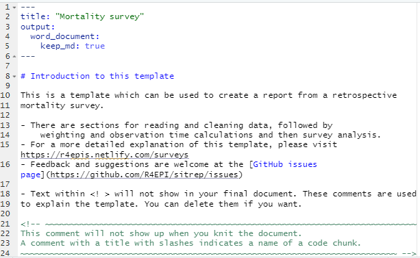

```{r, include = FALSE}
knitr::opts_chunk$set(
  warning = FALSE,
  message = FALSE,
  collapse = TRUE,
  comment = "#>",
  echo = TRUE
)
```

## Overview

This page demonstrate use of the {sitrep} R Markdown template for analysis of a retrospective mortality survey, using data from TODO. *This case study uses data that was produced using Kobo, a common survey and data collection tool in settings where MSF works.*

### Survey background

## Getting started

### Software installations

To begin using R, ensure you have the following free software installed:

1.  [R](https://cran.r-project.org/bin/windows/base/) (the free statistical software)
2.  [RStudio](https://www.rstudio.com/products/rstudio/download/#download) (the free user interface)
3.  [RTools](https://cran.r-project.org/bin/windows/Rtools/) (only needed for Windows computers)

If you are a new R user, we highly suggest doing the following before beginning to use these templates:

1.  Complete our 5 free online introductory [R tutorials](www.appliedepi.org/tutorial). To begin, create your free Applied Epi account, as explained in the linked page
2.  Review the [R basics chapter](https://epirhandbook.com/en/r-basics.html#r-basics) of our Epidemiologist R Handbook
3.  Review the [Reports with R Markdown chapter](https://epirhandbook.com/en/reports-with-r-markdown.html) of the Epidemiologist R Handbook

Once you have an understanding of how R and RStudio work, know how to run basic commands, have practiced running R code on your computer, and have read about R Markdown reports, then you are ready to use our {sitrep} R Markdown templates to produce situation reports.

### Install the {sitrep} R package

To access the templates, you must install the "sitrep" R package. R packages are often written in text with curly brackets, like this: {sitrep}

1.  Open RStudio
2.  Run the following command in the R Console pane:

```{r, eval=FALSE, echo=TRUE}
# install the {remotes} package, which is used to install the {sitrep} package
install.packages("remotes")
```

3.  Now run this command, also in the R Console pane. The {sitrep} package is currently available from a location on Github, a site to store and share code.

```{r, eval=FALSE, echo=TRUE}
# use {remotes} to install {sitrep} from Github
remotes::install_github("R4EPI/sitrep", dependencies = TRUE)
```

### Open a new RStudio project

Working in R is best done from within an "RStudio project" that contains all the datasets, R scripts, and outputs for a single analytical project.

You should review the Epidemiologist R Handbook chapters on [RStudio projects](https://epirhandbook.com/en/r-projects.html). Below are brief instructions on how to create a new RStudio project:

> Select *File -\> New Project* from the top RStudio menu.

> Creating a new R project will create:

> -   A new project directory (folder)\
> -   A R project file (.Rproj) in the project folder that serves as a shortcut to open the project via RStudio

> Note:

> -   You can make sub-folders for data, scripts, etc.\
> -   All files produced by R scripts saved to the project will also save into the project folder\
> -   Navigate and open project files, such as scripts, using the Files tab of the lower-right RStudio pane.\
>     \*For an RMarkdown to produce the final report correctly, you must have read/write permissions for the location of the R project folder. On an MSF computer this is generally the c:/temp folder.

One significant benefit of working within an R project is that all associated files (datasets, etc.) are located within the same folder. Thus, to send the project to someone else, **simply zip the folder and send**. All files referenced in the scripts are included and if you utilized the {here} package, no file paths are unique to your computer.

## Open a {sitrep} R Markdown template

For this vignette, you will need to open the template "Mortality survey". See the instructions and GIF below.

### Opening a template

1.  Ensure you have installed the {sitrep} package as detailed above\
2.  Go to the File menu, select "New File", and select "R Markdown"\
3.  In the pop-up window, select "From template"
4.  From the list of templates, select "AJS Outbreak Report" - the template will open in RStudio\
5.  Go to File, "Save", and write a name for this R Markdown script; save it into your RStudio Project folder

{width="549"} \### Folder structure

It is highly recommended that you store your R Markdown script and any data used in the same folder (the RStudio project). You should review the Epidemiologist R Handbook chapters on [RStudio projects](https://epirhandbook.com/en/r-projects.html).


## Basic concepts of survey data analysis

### Other resources  

This website will not cover the detailed aspects of designing, implementing and analysing a survey in MSF contexts. 
There are many other training and briefing materials that address this aspect. We will cover a few crucial concepts 
which are required for the understanding and use of the templates for your survey analysis.

For further survey methodology resources please see: 

* [MSF Field Research site](https://fieldresearch.msf.org/)
* [SMART Methodology](https://smartmethodology.org/about-smart/?doing_wp_cron=1569090491.1568140983581542968750) (Standardized Monitoring and Assessment of Relief and Transitions)
* This site on [the use of epidemiological tools in conflict-affected populations](http://conflict.lshtm.ac.uk/page_02.htm) from the London School of Hygiene and Tropical Medicine (LSHTM). 

### Sampling strategy
There are different ways to sample populations for surveys. The most commonly used in MSF settings are:

1. **Simple random sampling (SRS)**: requires a comprehensive sampling frame (i.e. total list of households inside a refugee camp or 
GPS based sampling in a known area).
2. **Cluster based sampling**: most commonly used in combination with sampling villages proportional to population size.
3. **Stratified samples**: uses either SRS or cluster based sampling but in two different adminstrative areas in order to obtain
precise prevalence estimates for them.

The templates can accomodate analysis of data from all sampling designs.

### Sample size
Before implementing a survey you will need to calculate the sample size for that survey.

When calculating a sample size for your survey you take the below parameters into consideration:

* **Estimate of prevalence**
* **Design effect or intraclass coefficient**
* **Precision required around your estimate of prevalence**

### Estimate of prevalence
You will need to use an estimate of the prevalence/coverage of the your main outcome of interest in your to-be-surveyed population
 (prevalence of malnutrition, measles vaccination coverage, etc.). You will use published or grey literature to determine a logical 
estimate of this parameter.

The largest sample size you will need will be that which is calculated using an estimate of prevalence of 50%. The closer to 0% or 100% prevalence you set your estimate, the smaller your sample size will be. Therefore, if you have no idea what your estimate of prevalence is, try and use 50% and the largest possible sample size.

### Design effect
The easiest way to remember the design effect (which we usually refer to as DEFF), is that it is a measure of the variability of the outcome of interest within your clusters (if you are conducting a cluster based survey) and between your clusters. 

The higher the DEFF, the higher the variability between clusters and the higher the probability that subjects within a cluster are similar.

In a well designed survey, you will aim to have a calculated DEFF for your outcome of interest as close as possible to 1. This is because a DEFF of 1 means that your survey design has approached Simple Random Sampling (SRS) for your outcome of interest. SRS is the gold standard in survey design, but often not possible in MSF contexts. In general, in two-stage cluster sampling surveys, we would assume a DEFF of 2.

Mathematically DEFF is calculated as:

> **DEFF=1+(1-n) * rho**
> where n=sample size of your survey and rho=intraclass coefficient

When analysing your survery data, we often recalculate the DEFF for the main outcomes of interest. This because the DEFF will give you a good estimate on whether the survey design and sampling approach made sense in your survey for your outcome of interest.

### Precision around your estimate
The precision around your estimate stipulates how close to the your estimate you would like the 95% confidence interval of your prevalence estimate to fall.

> **For example**: you have calculated a 72% measles vaccination coverage in your study population. You would like to ensure that the 
> 95% confidence interval is narrow (between 70-74%); thus you would set your precision at 2% (2% above and below 72%).

The lower your precision, the higher your sample size calculation will be.

You only use the estimate of the precision when calculating a sample size before your survey. 

### Data collection and databases
The templates assume that data will have been collected using mobile data collection or will have been entered into an electronic database (Excel, Epi Data, Redcap etc.).

We recommend that you try and establish generic data dictionaries for mobile data collection (through template questionnaires) or through template databases. This will improve the consistency of the naming of your variables and will facilitate the frequent and systematic use of the Survey Templates.

### Overview of survey template parts

We have designed the templates to run through a similar series of analytical questions in the same order:

1. **Description of your survey** sample and population in that survey sample
2. **Comparison of your survey sample** to the population breakdown of that area (this will help you understand how biased your data is)
3. **Calculation of the main outcomes of interest** (including DEFF): 

  * Mortality survey template: crude mortality rate (CMR) and under 5 year mortality rate (U5MR)
  * Vaccination coverage: vaccination coverage of vaccines of interest
  * Malnutrition: prevalence of malnutrition in target population through MUAC and Weight for Height Scores  
4. Calculation of **secondary outcomes of interest**

The sampling stratgey **MUST** be considered by the epidemiologist using the templates in order to ensure an appropriate weighting is applied to the analysis.


## Become familiar with the R Markdown template

### Header

The very top of the R Markdown template consists of a header surrounded by `---` lines. This is called the "YAML" header, in which you can edit the title of your document. The other settings in the header define the default document type produced (Microsoft Word) when the RMarkdown is "knit".



### Introduction to the template

This text just below the header is for your reference only. If left alone it will appear at the beginning of your report, so you should replace it with a more relevant introduction. Any text you write here can be formatted with *italics*, **bold**, bullets, numbers, tables, and in-line code. See this [RMarkdown cheatsheet](/images/rmarkdown_cheatsheet_2.0.pdf) for tips on formatting.

### Explanatory text

Green text located between these special characters (`<!--` and `-->`), is for your information only. This text will **not** appear in the final Word document report.

## Installing and loading packages


**The first code chunk, `setup`, is very important and must be kept.** When the final report is knit, this chunk will run without producing any output, but it is required for the template to work correctly.

This `setup` code chunk does the following:

-   Set default settings for tables such as size, error handling, and display of missing values

-   Run a command using the {pacman} package to install and load the R packages that are used in this template.

-   Set default text size in graphic plots

-   Establish visual theme settings for epidemic curve plots

### About the packages used in this template

#### Generic packages

| R package   | Use                                                                                |
|---------------|---------------------------------------------------------|
| {knitr}     | to create the output document (pdf, doc, html)                                     |
| {here}      | to locate files within the RStudio project                                         |
| {rio}       | to import data from various formats (csv, xlsx, tsv, etc.)                         |
| {janitor}   | to clean and summarise data                                                        |
| {dplyr}     | to clean and handle data                                                           |
| {tidyr}     | to handle and clean data                                                           |
| {forcats}   | to clean the data and create ordinal columns ("factors")                           |
| {stringr}   | to clean and handle text/characters (known as "strings")                           |
| {ggplot2}   | to visualise your data in plots                                                    |
| {lubridate} | to handle dates and times                                                          |
| {gtsummary} | to produce summary tables                                                          |
| {flextable} | to format summary tables for presentation                                          |
| {purrr}     | to iterate processes - repeating the same process many times with small variations |

#### More epidemiology- and survey-specific packages

| R package    | Use                                                                |
|------------------|-----------------------------------------------------|
| {sitrep}     | includes the templates and functions useful for field epidemiology |
| {ggalluvial} | to make alluvial flow diagrams/plots                               |
| {apyramid}   | to make demographic pyramid plots                                  |
| {parsedate}  | to interpret "messy" date formats                                  |
| {survey}     | to provide survey analysis functions                               |
| {srvyr}      | to make the {survey} package easier to use                         |
| {matchmaker} | to clean data using data dictionaries                              |
| {labelled}   | to add labels to columns                                           |


```{r echo=TRUE, eval=TRUE, warning=FALSE, message=FALSE}
# Install and load required packages for this template
pacman::p_load(
  knitr,       # create output docs
  here,        # find your files
  rio,         # for importing data
  janitor,     # clean/shape data
  dplyr,       # clean/shape data
  tidyr,       # clean/shape data
  forcats,     # manipulate and rearrange factors
  stringr,     # manipulate texts
  ggplot2,     # create plots and charts
  ggalluvial,  # for visualising population flows
  apyramid,    # plotting age pyramids
  sitrep,      # MSF field epi functions
  survey,      # for survey functions
  srvyr,       # dplyr wrapper for survey package
  gtsummary,   # produce tables
  flextable,   # for styling output tables
  labelled,    # add labels to variables
  matchmaker,  # recode datasets with dictionaries
  lubridate,   # working with dates
  parsedate    # guessing dates
  )
```


## Survey data

Data used for this template should be in a "linelist" format, with one row for each survey respondent person. You have two options:

-   Use data collected with Kobo

-   Use data that was not collected with Kobo

Each of these options will result in the use of different code chunks in the template. **This vignette uses data collected with Kobo**.

You can deactivate (place a \# comment symbol to the left of) or delete the code in the code chunk `read_fake_data`, which is used to generate fake data for the template.

### Download data used in this vignette

**This vignette will demonstrate using *data collected with Kobo***. 


#### Access the survey responses  

For this vignette, the household-level information and the individual-level information are stored in an .xslx spreadsheet with two sheets. The spreadsheet is named "mortality_survey_data.xlsx", and is stored in the {sitrep} R package. We created the function `download_survey()` which will copy this file into a location of your choice on your computer.  

Run the commands below. Now look for a pop-up window and use it to select your RStudio project folder (the pop-up may appear *behind* RStudio out-of-sight).  

```{r, echo=TRUE}
# load the sitrep package
library(sitrep)
```

```{r, eval= FALSE, echo=TRUE}
# run the command below as it is (empty parentheses).
# Look for a pop-up window, and select your RStudio project as the destination
download_survey()
```


Now that the data are saved in your RStudio project, you can import them into R using `import()`, as described in the Epidemiologist R Handbook's [Import and export](https://epirhandbook.com/en/import-and-export.html) chapter.

To import a specific sheet from an xlsx spreadsheet, use the `which = ` argument as shown below. You can also use the `na = ` argument to specify a value that should be converted to `NA` across the entire sheet (e.g. 99 or "Missing", or "" which represents an empty space). 

Th example command below imports an Excel spreadsheet called "mortality_survey_data.xlsx", which is not password protected, and is stored in the RStudio project you are using for this analysis. The `which =` argument of `import()` specifies that the sheet "Mortality Survey" should be imported. You would edit this command as appropriate for your situation.

```{r echo=TRUE, eval=FALSE}
# example code for importing an Excel file saved in RStudio project

# Import the sheet containing household responses
survey_data_hh <- import("mortality_survey_data.xlsx"), which = "Mortality Survey", na = "")

# import the sheet containing individual responses
survey_data_ind <- import("mortality_survey_data.xlsx"), which = "hh_member", na = "")
```


```{r, echo=FALSE}
# BACK-END INVISIBLE - load data for vignette use

survey_data_hh <- rio::import(system.file("extdata", "mortality_survey_data.xlsx", package = "sitrep"), which = "Mortality Survey", na = "")

survey_data_ind <- rio::import(system.file("extdata", "mortality_survey_data.xlsx", package = "sitrep"), which = "hh_member", na = "")

```


Here is a preview of the first 25 entries with household informaton:  

```{r, echo=FALSE}
DT::datatable(head(survey_data_hh, 25), rownames = FALSE, filter="top", options = list(pageLength = 5, scrollX=T), class = 'white-space: nowrap' )
```

</br>

And here is a look at the first 25 individual responses:  

```{r, echo=FALSE}
DT::datatable(head(survey_data_ind, 25), rownames = FALSE, filter="top", options = list(pageLength = 5, scrollX=T), class = 'white-space: nowrap' )
```

### Merge data levels

As we are using a Kobo dataset that has both individual and household data (stored in separate data frames), we will need to combine them using code in the `merge_data_levels` code chunk.  

Uncomment this code, and replace the defaults to reflect our datasets, as below:  

```{r}

## join the individual and household data to form a complete data set
study_data_raw <- left_join(survey_data_hh, survey_data_ind, by = c("_index" = "_parent_index"))

```

Here are the first 25 rows of this combined data frame `study_data_raw`. Scroll to the far right side to see the joined columns from `survey_data_ind`:  

```{r, echo=FALSE}
DT::datatable(head(study_data_raw, 25), rownames = FALSE, filter="top", options = list(pageLength = 5, scrollX=T), class = 'white-space: nowrap' )
```


### Prep Kobo data

In this chunk called `prep_kobo_data`, we run the command that creates `study_data_cleaned` as an exact copy of `study_data_raw`. This new data frame will be fully cleaned in subsequent sections.  

```{r}
study_data_cleaned <- study_data_raw
```

The next uncommented command is unnecessary and should be deactivated with # symbols. We do not have a column called `violence_nature_other` in our survey dataset.  

```{r}
# study_data_cleaned <- rename(study_data_cleaned,
#                              violence_nature_other_details    =  violence_nature_other)
```

Finally, we run the command to clean the column names. The `clean_names()` function from the {janitor} package will standardise the syntax of all the column names (headers) by converting all to lowercase, replacing spaces and special characters with underscores, etc.  

```{r}
## define clean variable names using clean_names from the janitor package. 
study_data_cleaned <- janitor::clean_names(study_data_cleaned)
```

Further data cleaning will occur in later data cleaning chunks.  


## Convert Kobo data dictionary


#### Kobo data dictionary

Surveys conducted with Kobo produce a data dictionary file, in which information about the variables are stored in one sheet, and information about the values ("choices") are stored in an adjacent sheet in the same Excel workbook. For this example, this file is named "mortality_survey_dict.xlsx", and is stored in the {sitrep} R package. We created the function `download_kobo()` which will copy this file into a location of your choice on your computer.  

Run the commands below. Now look for a pop-up window and use it to select your RStudio project folder (the pop-up may appear *behind* RStudio out-of-sight).  

```{r, echo=TRUE}
# load the sitrep package
library(sitrep)
```

```{r, eval= FALSE, echo=TRUE}
# run the command below as it is (empty parentheses).
# Look for a pop-up window, and select your RStudio project as the destination
download_kobo()
```


### Format data dictionary  

The {sitrep} package contains a function to import the Kobo data dictionary into R and format it to facilitate further data cleaning. You can uncomment this code in the chunk `prep_kobo_data`, modify it such that the `name = ` argument points to the location of your Kobo dictionary xlsx file, and run it. A new data frame object called `msf_dict` will be created in your R Environment.  

```{r, eval=FALSE}
# Import Kobo data dictionary into R and re-format to support data cleaning
study_data_dict <- msf_dict_survey(name = "mortality_survey_dict.xlsx",
                            template = FALSE)
```


```{r, echo=FALSE, eval=TRUE}
# BACK-END for vignette
study_data_dict <- msf_dict_survey(name = system.file("extdata", "mortality_survey_dict.xlsx", package = "sitrep"),
                     template = FALSE)
```

You can skip the code chunk `prep_nonkobo_data`.  


## Population data

This vignette does not include population data, so in the chunk `read_population_data` we will use the code that is uncommented by default - estimating populations using the proportions for sub-Saharan Africa in 2019 from the Doctors without Borders (MSF) OCBA population denominators tool v1.  

* We set the total population as 10,000, as a default assumption. TODO  
* We leave the proportion estimates as written  
* We have observations from "Town A" and "Town B" (see column `location` in the `survey_data_ind` data frame), so we edit the inputs to the `health_district` column as written in the final line of each command (see below).  

We run all the uncommented code provided in the template to generate the population estimates and combine them into one data frame.  


```{r}
population_data_age_district_a <- gen_population(total_pop = 10000, # set total population 
  groups      = c("0-2", "3-14", "15-29", "30-44", "45+"), # set groups
  proportions = c(0.0340, 0.1811, 0.1380, 0.0808, 0.0661), # set proportions for each group
  strata      = c("Male", "Female")) %>%           # stratify by gender
  rename(age_group  = groups,                      # rename columns (NEW NAME = OLD NAME)
         sex        = strata,
         population = n) %>% 
  mutate(health_district = "Town A")           # add a column to identify region 


## generate population data by age groups in years for district B
population_data_age_district_b <- gen_population(total_pop = 10000, # set total population 
  groups      = c("0-2", "3-14", "15-29", "30-44", "45+"), # set groups
  proportions = c(0.0340, 0.1811, 0.1380, 0.0808, 0.0661), # set proportions for each group
  strata      = c("Male", "Female")) %>%           # stratify by gender
  rename(age_group  = groups,                      # rename columns (NEW NAME = OLD NAME)
         sex        = strata,
         population = n) %>% 
  mutate(health_district = "Town B")           # add a column to identify region 


## bind region population data together to get overall population 
population_data_age <- bind_rows(population_data_age_district_a, 
                                 population_data_age_district_b)
```


### Cluster counts

```{r cluster_counts}

cluster_counts <- tibble(cluster = c("Town A", "Town B"), 
                         households = c(500, 700))
```


## Browse data


## Data cleaning


### Standardise dates

The first command creates an list of column names, called `DATEVARS`, using the imported and formatted Kobo data dictionary. The command looks into the `type` column of the dictionary, and extracts all the variables that are dates and that are also present in the `study_data_cleaned`. The names of these columns are saved as `DATEVARS`.  

```{r}
## get the names of variables which are dates
DATEVARS <- study_data_dict %>% 
  filter(type == "date") %>% 
  filter(name %in% names(study_data_cleaned)) %>% 
  ## filter to match the column names of your data
  pull(name) # select date vars
```


In the next command, from this list `DATEVARS`, and columns that are completely empty are identified. 

```{r}
## find if there are date variables which are completely empty
EMPTY_DATEVARS <- purrr::map(DATEVARS, ~all(
  is.na(study_data_cleaned[[.x]])
  )) %>% 
  unlist() %>% 
  which()
```

Finally, we using indexing (square brackets) and a minus sign to remove those date variables that were empty from the list `DATEVARS`.  


```{r}
## remove exclude the names of variables which are completely emptys
DATEVARS <- DATEVARS[-EMPTY_DATEVARS]
```


Not that we have a complete and verified list of used date variables, we can run the `across()` function within `mutate()` to convert all of the dates to class "Date". Recall that date columns must be properly recognized by R as dates in order to be used effectively.  

To convert the dates to class "Date" we use the function `parse_date()` from the {parsedate} package. This function does not assume a standard format to the dates, and evaluates every data frame cell individually, using intelligent guessing to decide whether the date is written as Month-Day-Year, Day-Month-Year, or Year-Month-Day, etc.

The result of `parse_date()` is actually class "POSIXct" (a specific type of date class), so the result is piped to `as.Date()` to convert it to a class that is more easily accepted by subsequent functions.  

```{r}
## change to dates 
## use the parse_date() function to make a first pass at date variables.
## parse_date() produces a complicated format - so we use as.Date() to simplify
study_data_cleaned <- study_data_cleaned %>%
  mutate(
    across(.cols = all_of(DATEVARS),
           .fns = ~parsedate::parse_date(.x) %>% as.Date()))
```


### Define recall period

After skipping the section on cleaning dates in *non-Kobo* data, we arrive at a command that defines the "recall period".  

In this vignette, the recall period begins 15 July 2020. We know this because in the data dictionary, the later questions ask about arrivals, departures, births, and deaths since 15 July 2020. *Therefore, we adjust the code so that for every entry in `study_data_cleaned` uses `as.Date("2020-07-15)` as the value in the new column `recall_start`.  

The date for the `recall_end` is assigned to 15 July 2021.  


```{r}
## set the start/end of recall period
## can be changed to date variables from dataset 
## (e.g. arrival date & date questionnaire)
study_data_cleaned <- study_data_cleaned %>% 
  mutate(recall_start = as.Date("2020-07-15"),  
         recall_end   = as.Date("2021-07-15")   
  )
```


### Fix wrong dates


We can check the ranges of our dates using `range()`


```{r}
range(study_data_cleaned$date)
```
They all appear to be within the expected range (July 2021), so there is no need to perform corrections.  


### Create age groups

In our survey data, the column `age_in_years` contain the age of the surveyed individual. Unfortunately, its values have been interpreted by R as class "character" (words), and not as numbers.  

```{r}
class(study_data_cleaned$age_in_years)
```

Before we can create age groups, we need to convert this column to class "integer".  

The R Markdown template expects the age columns to be named `age_years` and `age_months`, so for ease we will rename our columns to align with this expectation.  

Modify the first code in this chunk with two new lines, as shown below:    

```{r}
## make sure age is an integer 
study_data_cleaned <- study_data_cleaned %>% 
  rename(age_years = age_in_years,       # rename age columns
         age_months = age_in_months) %>%   
  mutate(age_years = as.integer(age_years))
```


We can now run the subsequent commands as written, to create age group columns reflecting years and months.  

The first command uses `mutate()` to create a column called `age_group`, using the function `age_categories()` from the {sitrep} package. This function can work in several ways, but we provide a list of break point values ("breakers") for our age groups.  

```{r}
## create an age group variable by specifying categorical breaks (of years)
study_data_cleaned <- study_data_cleaned %>% 
  mutate(age_group = age_categories(age_years, 
                                    breakers = c(0, 3, 15, 30, 45)
                                    ))
```


The second command is very similar, but looks at the column `age_months` and checks whether the age in months is less than 12. If so, it applies the same `age_categories()` function but uses break points more relevant to the months values (e.g. 6 months, 9 months, and 12 months). If the value in `age_months` is greater than 12, it is replaced with missing.  


```{r}
## create age group variable for under 2 years based on months
study_data_cleaned <- study_data_cleaned %>% 
  mutate(age_group_mon = if_else(
    ## if months <= 12 then calculated age groups 
    age_months <= 12, 
    age_categories(study_data_cleaned$age_months, 
                                        breakers = c(0, 6, 9, 12), 
                                        ceiling = TRUE), 
    ## otherwise set new variable to missing
    factor(NA)))
```


# we can wait on this for the study protocol 

# msf_dict_rename_helper()
# remove district for the stratified code,
# keep both as FALSE
# run all the analyses by age and sex
# (regular cluster survey)
# still weighting it like a stratefied cluster, but it probably is just cluster.
# in survey design chunk, just use stratefied cluster bc survey_design is what's used elsewhere


# counting per household how many people are in the house
# cl = dataset with populaton per cluster
# interviewed is how many people were interviewed in the hourse
# clusterx = tell which variables correspond
# the creating variables telling which are in each
# Include both hoursehold and cluster


# Docker
# build yourself a docker container and test locally


