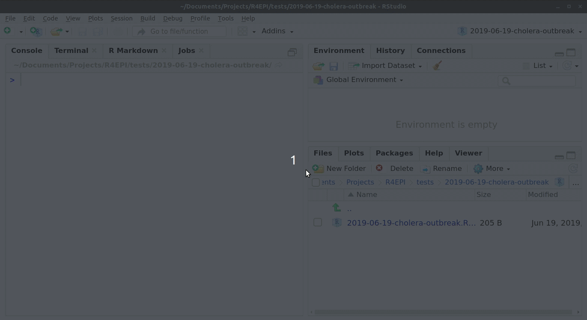

```{r, include = FALSE}
knitr::opts_chunk$set(
  warning = FALSE,
  message = FALSE,
  collapse = TRUE,
  comment = "#>",
  echo = TRUE,
  fig.width = 6,
  fig.height = 6
)
```

## Overview

This page demonstrate use of the {sitrep} R Markdown template for analysis of a retrospective mortality survey, using data that was produced using Kobo, a common survey and data collection tool in settings where MSF works. The data do not use the standard MSF EBB-approved data dictionary, and therefore represent a challenging use case for data cleaning.  

## Getting started

### Software installations

To begin using R, ensure you have the following free software installed:

1.  [R](https://cran.r-project.org/bin/windows/base/) (the free statistical software)
2.  [RStudio](https://www.rstudio.com/products/rstudio/download/#download) (the free user interface)
3.  [RTools](https://cran.r-project.org/bin/windows/Rtools/) (only needed for Windows computers)

If you are a new R user, we highly suggest doing the following before beginning to use these templates:

1.  Complete our 5 free online introductory [R tutorials](www.appliedepi.org/tutorial). To begin, create your free Applied Epi account, as explained in the linked page
2.  Review the [R basics chapter](https://epirhandbook.com/en/r-basics.html#r-basics) of our Epidemiologist R Handbook
3.  Review the [Reports with R Markdown chapter](https://epirhandbook.com/en/reports-with-r-markdown.html) of the Epidemiologist R Handbook

Once you have an understanding of how R and RStudio work, know how to run basic commands, have practiced running R code on your computer, and have read about R Markdown reports, then you are ready to use our {sitrep} R Markdown templates to produce situation reports.

### Install the {sitrep} R package

To access the templates, you must install the "sitrep" R package. R packages are often written in text with curly brackets, like this: {sitrep}

1.  Open RStudio
2.  Run the following command in the R Console pane:

```{r, eval=FALSE, echo=TRUE}
# install the {remotes} package, which is used to install the {sitrep} package
install.packages("remotes")
```

3.  Now run this command, also in the R Console pane. The {sitrep} package is currently available from a location on Github, a site to store and share code.

```{r, eval=FALSE, echo=TRUE}
# use {remotes} to install {sitrep} from Github
remotes::install_github("R4EPI/sitrep", dependencies = TRUE)
```

### Open a new RStudio project

Working in R is best done from within an "RStudio project" that contains all the datasets, R scripts, and outputs for a single analytical project.

You should review the Epidemiologist R Handbook chapters on [RStudio projects](https://epirhandbook.com/en/r-projects.html). Below are brief instructions on how to create a new RStudio project:

> Select *File -\> New Project* from the top RStudio menu.

> Creating a new RStudio project will create:

> -   A new project directory (folder)\
> -   A R project file (.Rproj) in the project folder that serves as a shortcut to open the project via RStudio

> Note:

> -   You can make sub-folders for data, scripts, etc.\
> -   All files produced by R scripts saved to the project will also save into the project folder\
> -   Navigate and open project files, such as scripts, using the Files tab of the lower-right RStudio pane.\
>     \*For an RMarkdown to produce the final report correctly, you must have read/write permissions for the location of the R project folder. On an MSF computer this is generally the c:/temp folder.

One significant benefit of working within an R project is that all associated files (datasets, etc.) are located within the same folder. Thus, to send the project to someone else, **simply zip the folder and send**. All files referenced in the scripts are included and if you utilized the {here} package, no file paths are unique to your computer.

## Open a {sitrep} R Markdown template

For this vignette, you will need to open the template "Mortality survey". See the instructions and GIF below.

### Opening a template

1.  Ensure you have installed the {sitrep} package as detailed above\
2.  Go to the File menu, select "New File", and select "R Markdown"\
3.  In the pop-up window, select "From template"
4.  From the list of templates, select "AJS Outbreak Report" - the template will open in RStudio\
5.  Go to File, "Save", and write a name for this R Markdown script; save it into your RStudio Project folder

{width="549"} \### Folder structure

It is highly recommended that you store your R Markdown script and any data used in the same folder (the RStudio project). You should review the Epidemiologist R Handbook chapters on [RStudio projects](https://epirhandbook.com/en/r-projects.html).


## Basic concepts of survey data analysis

### Other resources  

This website will not cover the detailed aspects of designing, implementing and analysing a survey in MSF contexts. 
There are many other training and briefing materials that address this aspect. We will cover a few crucial concepts 
which are required for the understanding and use of the templates for your survey analysis.

For further survey methodology resources please see: 

* [MSF Field Research site](https://fieldresearch.msf.org/)
* [SMART Methodology](https://smartmethodology.org/about-smart/?doing_wp_cron=1569090491.1568140983581542968750) (Standardized Monitoring and Assessment of Relief and Transitions)
* This site on [the use of epidemiological tools in conflict-affected populations](http://conflict.lshtm.ac.uk/page_02.htm) from the London School of Hygiene and Tropical Medicine (LSHTM). 

### Sampling strategy
There are different ways to sample populations for surveys. The most commonly used in MSF settings are:

1. **Simple random sampling (SRS)**: requires a comprehensive sampling frame (i.e. total list of households inside a refugee camp or 
GPS based sampling in a known area).
2. **Cluster based sampling**: most commonly used in combination with sampling villages proportional to population size.
3. **Stratified samples**: uses either SRS or cluster based sampling but in two different administrative areas in order to obtain
precise prevalence estimates for them.

The templates can accommodate analysis of data from all of these sampling designs.

### Sample size

Before implementing a survey you will need to calculate the sample size for that survey. Note that a chapter on samples size is anticipated to be in the [Epidemiologist R Handbook](www.epiRhandbook.com) soon.  

When calculating a sample size for your survey you take the below parameters into consideration:

* **Estimate of prevalence**
* **Design effect or intraclass coefficient**
* **Precision required around your estimate of prevalence**

### Estimate of prevalence
You will need to use an estimate of the prevalence/coverage of the your main outcome of interest in your to-be-surveyed population
 (prevalence of malnutrition, measles vaccination coverage, etc.). You will use published or grey literature to determine a logical 
estimate of this parameter.

The largest sample size you will need will be that which is calculated using an estimate of prevalence of 50%. The closer to 0% or 100% prevalence you set your estimate, the smaller your sample size will be. Therefore, if you have no idea what your estimate of prevalence is, try and use 50% and the largest possible sample size.

### Design effect
The easiest way to remember the design effect (which we usually refer to as DEFF), is that it is a measure of the variability of the outcome of interest within your clusters (if you are conducting a cluster based survey) and between your clusters. 

The higher the DEFF, the higher the variability between clusters and the higher the probability that subjects within a cluster are similar.

In a well designed survey, you will aim to have a calculated DEFF for your outcome of interest as close as possible to 1. This is because a DEFF of 1 means that your survey design has approached Simple Random Sampling (SRS) for your outcome of interest. SRS is the gold standard in survey design, but often not possible in MSF contexts. In general, in two-stage cluster sampling surveys, we would assume a DEFF of 2.

Mathematically DEFF is calculated as:

> **DEFF=1+(1-n) * rho**
> where n=sample size of your survey and rho=intraclass coefficient

When analysing your survey data, we often recalculate the DEFF for the main outcomes of interest. This because the DEFF will give you a good estimate on whether the survey design and sampling approach made sense in your survey for your outcome of interest.

### Precision around your estimate
The precision around your estimate stipulates how close to the your estimate you would like the 95% confidence interval of your prevalence estimate to fall.

> **For example**: you have calculated a 72% measles vaccination coverage in your study population. You would like to ensure that the 
> 95% confidence interval is narrow (between 70-74%); thus you would set your precision at 2% (2% above and below 72%).

The lower your precision, the higher your sample size calculation will be.

You only use the estimate of the precision when calculating a sample size before your survey. 

### Data collection and databases
The templates assume that data will have been collected using mobile data collection or will have been entered into an electronic database (Excel, Epi Data, Redcap etc.).

We recommend that you try and establish generic data dictionaries for mobile data collection (through template questionnaires) or through template databases. This will improve the consistency of the naming of your variables and will facilitate the frequent and systematic use of the Survey Templates.

### Overview of survey template parts

We have designed the templates to run through a similar series of analytical questions in the same order:

1. **Description of your survey** sample and population in that survey sample
2. **Comparison of your survey sample** to the population breakdown of that area (this will help you understand how biased your data is)
3. **Calculation of the main outcomes of interest** (including DEFF): 

  * Mortality survey template: crude mortality rate (CMR) and under 5 year mortality rate (U5MR)
  * Vaccination coverage: vaccination coverage of vaccines of interest
  * Malnutrition: prevalence of malnutrition in target population through MUAC and Weight for Height Scores  
4. Calculation of **secondary outcomes of interest**

The sampling strategy **MUST** be considered by the epidemiologist using the templates in order to ensure an appropriate weighting is applied to the analysis.


## Become familiar with the R Markdown template

### Header

The very top of the R Markdown template consists of a header surrounded by `---` lines. This is called the "YAML" header, in which you can edit the title of your document. The other settings in the header define the default document type produced (Microsoft Word) when the RMarkdown is "knit".


### Introduction to the template

This text just below the header is for your reference only. If left alone it will appear at the beginning of your report, so you should replace it with a more relevant introduction. Any text you write here can be formatted with *italics*, **bold**, bullets, numbers, tables, and in-line code. See this [RMarkdown cheatsheet](/images/rmarkdown_cheatsheet_2.0.pdf) for tips on formatting.

### Explanatory text

Green text located between these special characters (`<!--` and `-->`), is for your information only. This text will **not** appear in the final Word document report.

## Installing and loading packages


**The first code chunk, `setup`, is very important and must be kept.** When the final report is knit, this chunk will run without producing any output, but it is required for the template to work correctly.

This `setup` code chunk does the following:

-   Set default settings for tables such as size, error handling, and display of missing values

-   Run a command using the {pacman} package to install and load the R packages that are used in this template.

-   Set default text size in graphic plots

-   Establish visual theme settings for epidemic curve plots

### About the packages used in this template

#### Generic packages

| R package   | Use                                                                                |
|---------------|---------------------------------------------------------|
| {knitr}     | to create the output document (pdf, doc, html)                                     |
| {here}      | to locate files within the RStudio project                                         |
| {rio}       | to import data from various formats (csv, xlsx, tsv, etc.)                         |
| {janitor}   | to clean and summarise data                                                        |
| {dplyr}     | to clean and handle data                                                           |
| {tidyr}     | to handle and clean data                                                           |
| {forcats}   | to clean the data and create ordinal columns ("factors")                           |
| {stringr}   | to clean and handle text/characters (known as "strings")                           |
| {ggplot2}   | to visualise your data in plots                                                    |
| {lubridate} | to handle dates and times                                                          |
| {gtsummary} | to produce summary tables                                                          |
| {flextable} | to format summary tables for presentation                                          |
| {purrr}     | to iterate processes - repeating the same process many times with small variations |

#### More epidemiology- and survey-specific packages

| R package    | Use                                                                |
|------------------|-----------------------------------------------------|
| {sitrep}     | includes the templates and functions useful for field epidemiology |
| {ggalluvial} | to make alluvial flow diagrams/plots                               |
| {apyramid}   | to make demographic pyramid plots                                  |
| {parsedate}  | to interpret "messy" date formats                                  |
| {survey}     | to provide survey analysis functions                               |
| {srvyr}      | to make the {survey} package easier to use                         |
| {matchmaker} | to clean data using data dictionaries                              |
| {labelled}   | to add labels to columns                                           |


```{r echo=TRUE, eval=TRUE, warning=FALSE, message=FALSE}
# Install and load required packages for this template
pacman::p_load(
  knitr,       # create output docs
  here,        # find your files
  rio,         # for importing data
  janitor,     # clean/shape data
  dplyr,       # clean/shape data
  tidyr,       # clean/shape data
  forcats,     # manipulate and rearrange factors
  stringr,     # manipulate texts
  ggplot2,     # create plots and charts
  ggalluvial,  # for visualising population flows
  apyramid,    # plotting age pyramids
  sitrep,      # MSF field epi functions
  survey,      # for survey functions
  srvyr,       # dplyr wrapper for survey package
  gtsummary,   # produce tables
  flextable,   # for styling output tables
  labelled,    # add labels to variables
  matchmaker,  # recode datasets with dictionaries
  lubridate,   # working with dates
  parsedate    # guessing dates
  )
```


## Survey data

Data used for this template should be in a "linelist" format, with one row for each survey respondent person. You have two options:

-   Use data collected with Kobo

-   Use data that was not collected with Kobo

Each of these options will result in the use of different code chunks in the template. **This vignette uses data collected with Kobo**.

You can deactivate (place a \# comment symbol to the left of) or delete the code in the code chunk `read_fake_data`, which is used to generate fake data for the template.

### Download data used in this vignette

**This vignette will demonstrate using *data collected with Kobo***. 


#### Access the survey responses  

For this vignette, the household-level information and the individual-level information are stored in an .xslx spreadsheet with two sheets. The spreadsheet is named "mortality_survey_data.xlsx", and is stored in the {sitrep} R package. We created the function `download_survey()` which will copy this file into a location of your choice on your computer.  

Run the commands below. Now look for a pop-up window and use it to select your RStudio project folder (the pop-up may appear *behind* RStudio out-of-sight).  

```{r, echo=TRUE}
# load the sitrep package
library(sitrep)
```

```{r, eval= FALSE, echo=TRUE}
# run the command below as it is (empty parentheses).
# Look for a pop-up window, and select your RStudio project as the destination
download_survey()
```


Now that the data are saved in your RStudio project, you can import them into R using `import()`, as described in the Epidemiologist R Handbook's [Import and export](https://epirhandbook.com/en/import-and-export.html) chapter.

To import a specific sheet from an xlsx spreadsheet, use the `which = ` argument as shown below. You can also use the `na = ` argument to specify a value that should be converted to `NA` across the entire sheet (e.g. 99 or "Missing", or "" which represents an empty space). 

Th example command below imports an Excel spreadsheet called "mortality_survey_data.xlsx", which is not password protected, and is stored in the RStudio project you are using for this analysis. The `which =` argument of `import()` specifies that the sheet "Mortality Survey" should be imported. You would edit this command as appropriate for your situation.

```{r echo=TRUE, eval=FALSE}
# example code for importing an Excel file saved in RStudio project

# Import the sheet containing household responses
survey_data_hh <- import("mortality_survey_data.xlsx"), which = "Mortality Survey", na = "")

# import the sheet containing individual responses
survey_data_ind <- import("mortality_survey_data.xlsx"), which = "hh_member", na = "")
```


```{r, echo=FALSE}
# BACK-END INVISIBLE - load data for vignette use

survey_data_hh <- rio::import(system.file("extdata", "mortality_survey_data.xlsx", package = "sitrep"), which = "Mortality Survey", na = "")

survey_data_ind <- rio::import(system.file("extdata", "mortality_survey_data.xlsx", package = "sitrep"), which = "hh_member", na = "")

```


Here is a preview of the first 25 entries with household information:  

```{r, echo=FALSE}
DT::datatable(head(survey_data_hh, 25), rownames = FALSE, filter="top", options = list(pageLength = 5, scrollX=T), class = 'white-space: nowrap' )
```

</br>

And here is a look at the first 25 individual responses:  

```{r, echo=FALSE}
DT::datatable(head(survey_data_ind, 25), rownames = FALSE, filter="top", options = list(pageLength = 5, scrollX=T), class = 'white-space: nowrap' )
```

### Merge data levels

As we are using a Kobo dataset that has both individual and household data (stored in separate data frames), we will need to combine them using code in the `merge_data_levels` code chunk.  

Uncomment this code, and replace the defaults to reflect our data sets, as below:  

```{r}

## join the individual and household data to form a complete data set
study_data_raw <- left_join(survey_data_hh, survey_data_ind, by = c("_index" = "_parent_index"))

```

Here are the first 25 rows of this combined data frame `study_data_raw`. Scroll to the far right side to see the joined columns from `survey_data_ind`:  

```{r, echo=FALSE}
DT::datatable(head(study_data_raw, 25), rownames = FALSE, filter="top", options = list(pageLength = 5, scrollX=T), class = 'white-space: nowrap' )
```


### Prep data

This dataset was produced with Kobo, but does not exactly align with the MSF data dictionary for mortality surveys. **Therefore, for this report we must treat it as "non-Kobo" and take actions to align it with the expected column names.**  

Therefore, to prepare the data you should **comment/deactivate with #** the chunk called `prep_kobo_data`. Instead, we will use the approach outlined in the code chunk `prep_nonkobo_data`.  

The main activity to prep the data is alignment of the column names to those expected by this R Markdown template.  


First, we can un-comment and run the command that creates `study_data_cleaned` as an exact copy of `study_data_raw`. This new data frame will be fully cleaned in subsequent sections.  

```{r}
study_data_cleaned <- study_data_raw
```

Next, we want to rename some of our columns. Using the command `msf_dict_rename_helper("mortality", varnames = "name")` we get a "helped" command copied to our clipboard. This contains many more variables than we need, but it is useful to review.  

<details><summary>Click to see this code chunk></summary>

```{r, eval=FALSE, echo = TRUE}

## Add the appropriate column names after the equals signs
# 
# linelist_cleaned <- rename(linelist_cleaned,
#   age_months                         =   , # integer         (REQUIRED)
#   age_years                          =   , # integer         (REQUIRED)
#   arrived                            =   , # yn              (REQUIRED)
#   care_fever                         =   , # yndk            (REQUIRED)
#   care_illness_recent                =   , # yndk            (REQUIRED)
#   cause                              =   , # cause           (REQUIRED)
#   cause_illness                      =   , # cause           (REQUIRED)
#   cluster_number                     =   , # integer         (REQUIRED)
#   consent                            =   , # yn              (REQUIRED)
#   date                               =   , # date            (REQUIRED)
#   date_arrived                       =   , # date            (REQUIRED)
#   date_birth                         =   , # date            (REQUIRED)
#   date_death                         =   , # date            (REQUIRED)
#   date_left                          =   , # date            (REQUIRED)
#   died                               =   , # yn              (REQUIRED)
#   end                                =   , # end             (REQUIRED)
#   fever_now                          =   , # yndk            (REQUIRED)
#   fever_past_weeks                   =   , # yndk            (REQUIRED)
#   height                             =   , # integer         (REQUIRED)
#   household_number                   =   , # integer         (REQUIRED)
#   ill_hh_number                      =   , # integer         (REQUIRED)
#   ill_recently                       =   , # yndk            (REQUIRED)
#   left                               =   , # yn              (REQUIRED)
#   member_number                      =   , # integer         (REQUIRED)
#   no_care_illness                    =   , # no_care         (REQUIRED)
#   no_consent_reason                  =   , # no_consent      (REQUIRED)
#   place_violence                     =   , # viol_place      (REQUIRED)
#   pregnant                           =   , # yn              (REQUIRED)
#   reason_no_care                     =   , # no_care         (REQUIRED)
#   sex                                =   , # sex             (REQUIRED)
#   start                              =   , # start           (REQUIRED)
#   uniform                            =   , # ynnr            (REQUIRED)
#   village_name                       =   , # village         (REQUIRED)
#   violence_nature                    =   , # violence_nature (REQUIRED)
#   violence_nature_other              =   , # text            (REQUIRED)
#   violent_episode                    =   , # ynnr            (REQUIRED)
#   violent_episodes_number            =   , # integer         (REQUIRED)
#   weight                             =   , # integer         (REQUIRED)
#   after_leaving_hf                   =   , # text            (optional)
#   anc_bednet                         =   , # yndk            (optional)
#   anti_malarials                     =   , # yndk            (optional)
#   anti_malarials_listed              =   , # anti_malarials  (optional)
#   axiliary_temp                      =   , # integer         (optional)
#   bednet                             =   , # yn              (optional)
#   born                               =   , # yn              (optional)
#   born_later                         =   , # yn              (optional)
#   care_dying                         =   , # yndk            (optional)
#   care_illness_df                    =   , # yndk            (optional)
#   care_illness_last                  =   , # yndk            (optional)
#   cause_illness_df                   =   , # illness         (optional)
#   cause_illness_last                 =   , # cause           (optional)
#   cause_illness_last_other           =   , # text            (optional)
#   cause_illness_other                =   , # text            (optional)
#   cause_other                        =   , # text            (optional)
#   cost_consultation                  =   , # integer         (optional)
#   cost_consultation_df               =   , # integer         (optional)
#   cost_consultation_last             =   , # integer         (optional)
#   cost_treatment                     =   , # integer         (optional)
#   cost_treatment_df                  =   , # integer         (optional)
#   cost_treatment_last                =   , # integer         (optional)
#   current_status                     =   , # status          (optional)
#   date_death_alt                     =   , # date            (optional)
#   date_violence                      =   , # date            (optional)
#   deviceid                           =   , # deviceid        (optional)
#   diarrhoea_fever_2weeks             =   , # yndk            (optional)
#   education_level                    =   , # education_level (optional)
#   height_mal                         =   , # integer         (optional)
#   hemocue                            =   , # integer         (optional)
#   herbal_medicines                   =   , # herbs           (optional)
#   households_building                =   , # integer         (optional)
#   last_person_ill                    =   , # yndk            (optional)
#   malaria_episodes                   =   , # integer         (optional)
#   malaria_test                       =   , # test            (optional)
#   malaria_treatment                  =   , # yn              (optional)
#   malaria_treatment_infant           =   , # treatment       (optional)
#   malaria_treatment_preg             =   , # treatment       (optional)
#   measles_vaccination                =   , # yn              (optional)
#   muac                               =   , # integer         (optional)
#   muac_mal                           =   , # integer         (optional)
#   n1                                 =   , # note            (optional)
#   n10                                =   , # note            (optional)
#   n11                                =   , # note            (optional)
#   n12                                =   , # note            (optional)
#   n13                                =   , # note            (optional)
#   n2                                 =   , # note            (optional)
#   n3                                 =   , # note            (optional)
#   n4                                 =   , # note            (optional)
#   n5                                 =   , # note            (optional)
#   n6                                 =   , # note            (optional)
#   n7                                 =   , # note            (optional)
#   n8                                 =   , # note            (optional)
#   n9                                 =   , # note            (optional)
#   no_care_illness_df                 =   , # no_care         (optional)
#   no_care_illness_df_other           =   , # text            (optional)
#   no_care_illness_last               =   , # no_care         (optional)
#   no_care_illness_last_other         =   , # text            (optional)
#   no_care_illness_other              =   , # text            (optional)
#   no_consent_other                   =   , # text            (optional)
#   oedema                             =   , # measure         (optional)
#   oedema_mal                         =   , # measure         (optional)
#   period_illness_hsb                 =   , # period          (optional)
#   period_illness_hsb_number          =   , # integer         (optional)
#   period_illness_viol                =   , # period          (optional)
#   period_illness_viol_number         =   , # integer         (optional)
#   place_care_dying                   =   , # place_death     (optional)
#   place_care_illness                 =   , # place_hf        (optional)
#   place_care_illness_other           =   , # text            (optional)
#   place_death                        =   , # place_death     (optional)
#   place_death_hsb                    =   , # place_death     (optional)
#   place_death_hsb_other              =   , # text            (optional)
#   place_death_other                  =   , # text            (optional)
#   place_death_viol                   =   , # place_death     (optional)
#   place_death_viol_other             =   , # text            (optional)
#   place_first_hf                     =   , # place_hf        (optional)
#   place_first_hf_df                  =   , # place_hf        (optional)
#   place_first_hf_df_other            =   , # text            (optional)
#   place_first_hf_other               =   , # text            (optional)
#   place_healthcare                   =   , # place_treatment (optional)
#   place_healthcare_other             =   , # text            (optional)
#   place_second_hf                    =   , # place_hf        (optional)
#   place_second_hf_df                 =   , # place_hf        (optional)
#   place_second_hf_df_other           =   , # text            (optional)
#   place_second_hf_other              =   , # text            (optional)
#   place_violence_other               =   , # text            (optional)
#   present_start                      =   , # yn              (optional)
#   present_today                      =   , # yn              (optional)
#   random_hh                          =   , # calculate       (optional)
#   random_hh_note                     =   , # note            (optional)
#   rdt                                =   , # test2           (optional)
#   read_write                         =   , # yn              (optional)
#   reason_first_hf_selected           =   , # reason_hf       (optional)
#   reason_first_hf_selected_df        =   , # reason_hf       (optional)
#   reason_first_hf_selected_df_other  =   , # text            (optional)
#   reason_first_hf_selected_other     =   , # text            (optional)
#   reason_no_care_hsb                 =   , # no_care         (optional)
#   reason_no_care_hsb_other           =   , # text            (optional)
#   reason_no_care_other               =   , # text            (optional)
#   reason_not_present                 =   , # reason_absent   (optional)
#   reason_second_hf_selected          =   , # reason_hf       (optional)
#   reason_second_hf_selected_df       =   , # reason_hf       (optional)
#   reason_second_hf_selected_df_other =   , # text            (optional)
#   reason_second_hf_selected_other    =   , # text            (optional)
#   remember_arrival                   =   , # yn              (optional)
#   remember_death                     =   , # yn              (optional)
#   remember_departure                 =   , # yn              (optional)
#   remember_dob                       =   , # yn              (optional)
#   remember_violence_date             =   , # yn              (optional)
#   source_date_death_hsb              =   , # date            (optional)
#   source_date_death_viol             =   , # date            (optional)
#   source_death_hsb                   =   , # source          (optional)
#   source_death_viol                  =   , # source          (optional)
#   source_money_df                    =   , # money_source    (optional)
#   source_money_df_other              =   , # text            (optional)
#   source_money_last                  =   , # money_source    (optional)
#   source_money_last_other            =   , # text            (optional)
#   source_written_death_hsb           =   , # text            (optional)
#   source_written_death_viol          =   , # text            (optional)
#   source_written_hsb                 =   , # text            (optional)
#   source_written_viol                =   , # text            (optional)
#   spleen                             =   , # integer         (optional)
#   start_illness                      =   , # period          (optional)
#   start_illness_number               =   , # integer         (optional)
#   status_df                          =   , # status          (optional)
#   team_number                        =   , # integer         (optional)
#   thick_smear                        =   , # yn              (optional)
#   thin_smear                         =   , # yn              (optional)
#   today                              =   , # today           (optional)
#   treatment_delay                    =   , # time            (optional)
#   treatment_delay_df                 =   , # time            (optional)
#   vaccination_card                   =   , # yn              (optional)
#   village_other                      =   , # text            (optional)
#   visit_second_hf                    =   , # yndk            (optional)
#   visit_second_hf_df                 =   , # yndk            (optional)
#   weight_mal                         =     # integer         (optional)
# )
# 

```

</details>


We can edit the above, or simply refer to it to construct our `rename()` command, as below:   

```{r}
study_data_cleaned <- rename(study_data_cleaned,
  # pattern is NEW name = OLD name
  uid = `_index.y`,
  consent = household_consents_to_particip,
  age_years = age_in_years,       
  age_months = age_in_months,
  date_arrived = doa,
  date_birth = dob,
  date_left = dod,
  date_death = dodeath,
  member_number = no_household
  )

```

In the template, there is a command that creates the column `health_district`. For us, this information is already stored in the column `location`. So we run this command to re-name `location` as `health_district`.  

```{r}
study_data_cleaned <- rename(study_data_cleaned,
  health_district = location)

```

Finally, we run the command to clean the column names. The `clean_names()` function from the {janitor} package will standardise the syntax of all the column names (headers) by converting all to lowercase, replacing spaces and special characters with underscores, etc.  

```{r}
## define clean variable names using clean_names from the janitor package. 
study_data_cleaned <- clean_names(study_data_cleaned)
```

Further data cleaning will occur in later data cleaning chunks.  


## Convert Kobo data dictionary


#### Kobo data dictionary

Surveys conducted with Kobo produce a data dictionary file, in which information about the variables are stored in one sheet, and information about the values ("choices") are stored in an adjacent sheet in the same Excel workbook. For this example, this file is named "mortality_survey_dict.xlsx", and is stored in the {sitrep} R package. We created the function `download_kobo()` which will copy this file into a location of your choice on your computer.  

Run the commands below. Now look for a pop-up window and use it to select your RStudio project folder (the pop-up may appear *behind* RStudio out-of-sight).  

```{r, echo=TRUE}
# load the sitrep package
library(sitrep)
```

```{r, eval= FALSE, echo=TRUE}
# run the command below as it is (empty parentheses).
# Look for a pop-up window, and select your RStudio project as the destination
download_kobo()
```


### Format data dictionary  

The {sitrep} package contains a function to import the Kobo data dictionary into R and format it to facilitate further data cleaning. You can uncomment this code in the chunk `prep_kobo_data`, modify it such that the `name = ` argument points to the location of your Kobo dictionary xlsx file, and run it. We also add the arguement `compact = FALSE` so that the dictionary is displayed to us as a more readable format, with each option having its own row.  

```{r, eval=FALSE}
# Import Kobo data dictionary into R and re-format to support data cleaning
study_data_dict <- msf_dict_survey(name = "mortality_survey_dict.xlsx",
                            template = FALSE, 
                            compact = FALSE)
```


```{r, echo=FALSE, eval=TRUE}
# BACK-END for vignette
study_data_dict <- msf_dict_survey(name = system.file("extdata", "mortality_survey_dict.xlsx", package = "sitrep"),
                     template = FALSE,
                     compact = FALSE)
```

You can skip the code chunk `prep_nonkobo_data`.  


## Population data

This vignette does not include population data, so in the chunk `read_population_data` we will use the code that is uncommented by default - estimating populations using the proportions for sub-Saharan Africa in 2019 from the Doctors without Borders (MSF) OCBA population denominators tool v1.  

* We set the total population as 10,000, as a default assumption.  
* We leave the proportion estimates as written  
* We have observations from "Town A" and "Town B", so we edit the inputs to the `health_district` column as written in the final line of each command (see below).  

We run all the uncommented code provided in the template to generate the population estimates and combine them into one data frame.  


```{r}
population_data_age_district_a <- gen_population(total_pop = 10000, # set total population 
  groups      = c("0-2", "3-14", "15-29", "30-44", "45+"), # set groups
  proportions = c(0.0340, 0.1811, 0.1380, 0.0808, 0.0661), # set proportions for each group
  strata      = c("Male", "Female")) %>%           # stratify by gender
  rename(age_group  = groups,                      # rename columns (NEW NAME = OLD NAME)
         sex        = strata,
         population = n) %>% 
  mutate(health_district = "Town A")           # add a column to identify region 


## generate population data by age groups in years for district B
population_data_age_district_b <- gen_population(total_pop = 10000, # set total population 
  groups      = c("0-2", "3-14", "15-29", "30-44", "45+"), # set groups
  proportions = c(0.0340, 0.1811, 0.1380, 0.0808, 0.0661), # set proportions for each group
  strata      = c("Male", "Female")) %>%           # stratify by gender
  rename(age_group  = groups,                      # rename columns (NEW NAME = OLD NAME)
         sex        = strata,
         population = n) %>% 
  mutate(health_district = "Town B")           # add a column to identify region 


## bind region population data together to get overall population 
population_data_age <- bind_rows(population_data_age_district_a, 
                                 population_data_age_district_b)
```


### Cluster counts

We can see that there are 17 clusters, from each town:  

```{r}
study_data_cleaned %>% 
  tabyl(cluster_number, health_district)
```

The fact that there are clusters 1-17 in each of the Towns will complicate later analyses. Each cluster should have a unique identification value. So, let us create one. We use the `str_glue()` function from {stringr} to combine the cluster number and the letter of the town. The letter of the town is extracted from the town name using `str_sub()`, which is also from the {stringr} package. The -1 extracts the last letter of the village name, and places it into the ID.  

```{r}
study_data_cleaned <- study_data_cleaned %>% 
  mutate(cluster_number_uid = str_glue(
    "{town_letter}_{cluster_number}",
    town_letter = str_sub(health_district, -1)))
```

We verify:

```{r}
study_data_cleaned %>% 
  tabyl(cluster_number_uid, health_district)
```


Now, our task is to create a *new* data frame that contains the number of households in each cluster. This is not the number of households chosen to be interviewed, but the universe of *possible* households that could have been chosen in each cluster.  

To create a *new* dataframe, the R Markdown template uses the `tibble()` function for your to manually input the names of the clusters, and the number of households. Below, we use a slight adaptation for ease of use: we use the `tribble()` function (note the "r") so that we can type this information in "rows" that look like a normal data frame. Note how the columns are specified at the top with tildes (~).  

  

```{r cluster_counts}

cluster_counts <- tribble(
  ~cluster, ~households,
  "A_1",     100,
  "A_2", 100, 
  "A_3", 100, 
  "A_4", 100,
  "A_5", 100,
  "A_6", 100, 
  "A_7", 100,
  "A_8", 100, 
  "A_9", 100, 
  "A_10", 100, 
  "A_11", 100, 
  "A_12", 100, 
  "A_13", 100,
  "A_14", 100, 
  "A_15", 100, 
  "A_16", 100, 
  "A_17", 100, 
  
  "B_1", 100,
  "B_2", 100, 
  "B_3", 100, 
  "B_4", 100,
  "B_5", 100,
  "B_6", 100, 
  "B_7", 100,
  "B_8", 100, 
  "B_9", 100, 
  "B_10", 100, 
  "B_11", 100, 
  "B_12", 100, 
  "B_13", 100,
  "B_14", 100, 
  "B_15", 100, 
  "B_16", 100, 
  "B_17", 100)
```


## Browse data

This chunk includes R commands to help you familiarise yourself with your dataset.  

## Data cleaning


### Standardise dates

The goal with this code chunk is to convert all date columns to Date class so that R can handle them correctly. Here, again, we need to follow the instructions for "non-Kobo" because our data dictionary is not standard for MSF. 

The default code uses the data dictionary to create a `DATEVARS` object, but we will comment that section to deactivate it, and instead use the "non-Kobo" method which searches for all columns that contain the word "date" or "Date", and converts them to class Date.  

To convert the dates to class "Date" we use the function `parse_date()` from the {parsedate} package. This function does not assume a standard format to the dates, and evaluates every data frame cell individually, using intelligent guessing to decide whether the date is written as Month-Day-Year, Day-Month-Year, or Year-Month-Day, etc.

The result of `parse_date()` is actually class "POSIXct" (a specific type of date class), so the result is piped to `as.Date()` to convert it to a class that is more easily accepted by subsequent functions.  


```{r}

## Kobo standard data --------------------------------------------------------
## If you got your data from Kobo, use this portion of the code.
## If not, comment this section out and use the below.

## make sure all date variables are formatted as dates 
## get the names of variables which are dates
# DATEVARS <- study_data_dict %>% 
#   filter(type == "date") %>% 
#   filter(name %in% names(study_data_cleaned)) %>% 
#   ## filter to match the column names of your data
#   pull(name) # select date vars
# 
# ## find if there are date variables which are completely empty
# EMPTY_DATEVARS <- purrr::map(DATEVARS, ~all(
#   is.na(study_data_cleaned[[.x]])
#   )) %>% 
#   unlist() %>% 
#   which()
# 
# ## remove exclude the names of variables which are completely emptys
# DATEVARS <- DATEVARS[-EMPTY_DATEVARS]
# 
# ## change to dates 
# ## use the parse_date() function to make a first pass at date variables.
# ## parse_date() produces a complicated format - so we use as.Date() to simplify
# study_data_cleaned <- study_data_cleaned %>%
#   mutate(
#     across(.cols = all_of(DATEVARS),
#            .fns = ~parsedate::parse_date(.x) %>% as.Date()))


## Non-Kobo data -------------------------------------------------------------
## Use this section if you did not have Kobo data. 

# use the parse_date() function to make a first pass at date variables.
# parse_date() produces a complicated format - so we use as.Date() to simplify
study_data_cleaned <- study_data_cleaned %>%
  mutate(
    across(.cols = matches("date|Date"),
           .fns  = ~parsedate::parse_date(.x) %>% as.Date()))

```


### Define recall period

The next section of code to run defines the "recall period".  

In this vignette, the recall period is from 15 July 2020 to 15 July 2021, because this is indicated in the data dictionary questions about arrivals, departures, births, and deaths. *Therefore, we adjust the code so that for every entry in `study_data_cleaned` uses `as.Date("2020-07-15)` as the value in the new column `recall_start`, and uses `as.Date("2021-07-15")` as the value in the new column `recall_end`.  


```{r}
## set the start/end of recall period
## can be changed to date variables from dataset 
## (e.g. arrival date & date questionnaire)
study_data_cleaned <- study_data_cleaned %>% 
  mutate(recall_start = as.Date("2020-07-15"),  
         recall_end   = as.Date("2021-07-15")   
  )
```


### Create age groups

Information on age is spread across two columns: `age_years` and `age_months`.


Unfortunately, the values in these columns have been interpreted by R as class "character" (words), and not as numbers.  

```{r}
class(study_data_cleaned$age_years)
class(study_data_cleaned$age_months)
```

We can also review the dataset and see that if the age of respondents less than 1 year, the months are given in the `age_months` column but the `age_years` value is `NA` (missing). We will need the `age_years` column in this circumstance to have the value `0` for later calculations. So, we write and run the following command:  

```{r}
study_data_cleaned <- study_data_cleaned %>% 
  
  # convert both columns to class integer
  mutate(age_years = as.integer(age_years),
         age_months = as.integer(age_months)) %>%
  
  # convert age_years to 0 if age_months is less than 12
  mutate(age_years = case_when(
    age_months < 12 ~ as.integer(0),    # if age is less than 12 months, put 0
    TRUE            ~ age_years         # otherwise, leave as age_years value
  ))

```


We can now run the subsequent commands as written, to create age group columns reflecting years and months.  

The first command uses `mutate()` to create a column called `age_group`, using the function `age_categories()` from the {sitrep} package. This function can work in several ways, but we provide a list of break point values ("breakers") for our age groups.  

```{r}
## create an age group variable by specifying categorical breaks (of years)
study_data_cleaned <- study_data_cleaned %>% 
  mutate(age_group = age_categories(age_years, 
                                    breakers = c(0, 3, 15, 30, 45)
                                    ))
```


The second command in the template is very similar to the first, but looks at the column `age_months` and checks whether the age in months is less than 12. If so, it applies the same `age_categories()` function but uses break points more relevant to the months values (e.g. 6 months, 9 months, and 12 months). If the value in `age_months` is greater than 12, it is replaced with missing.  


```{r}
## create age group variable for under 2 years based on months
study_data_cleaned <- study_data_cleaned %>% 
  mutate(age_group_mon = if_else(
    ## if months <= 12 then calculated age groups 
    age_months <= 12, 
    age_categories(study_data_cleaned$age_months, 
                                        breakers = c(0, 6, 9, 12), 
                                        ceiling = TRUE), 
    ## otherwise set new variable to missing
    factor(NA)))
```

Finally, we run the last command in this chunk which creates a column `age_category` that combines the years groupings and the months groupings into one column, with a specified order.  

```{r}
## to combine different age categories use the following function 
## this prioritises the smaller unit, meaning:
## it will order your age_category from smallest to largest unit 
## i.e. days first then months then years (depending on which are given)
study_data_cleaned <- group_age_categories(study_data_cleaned, 
                                           years  = age_group,
                                           months = age_group_mon)
```


We can see this ordering if we run a quick table of the new column:

```{r}
study_data_cleaned %>% 
  tabyl(age_category) %>% 
  adorn_pct_formatting()
```


### Using a data dictionary to recode

The datasets in this vignette already use the cleaned values, according to its data dictionary. For example, the town is recorded as "Town A" or "Town B", not as town_a and town_b. 

If your dataset contains values that are "raw", unclean, or not in a display format, you can recode them using the data dictionary and the code in this chunk.  

For example, looking in the data dictionary (`study_data_dict`) we can see that the column `option_name` contains values such as `diarrhoea` and `respiratory_infection` for the cause of death variable. In contrast, the `option_label` contains the display values "Diarrhoea" and "Respiratory infection".  

A command like the below would revise all the raw option values to their display label version, across the entire dataset. The function `match_df()` accepts the name of our data frame, and the dictionary, the columns in the data dictionary to guide the value conversion (`from = ` and `to = `). Note that if provided in the data dictionary, you could also run the code with `to = "option_label_french"` to convert the values to French.  

Again - it is **NOT** necessary to run this code for this vignette because the values are already in display format.  

```{r, eval=FALSE}
## recode values with matchmaker package (value labels cant be used for analysis) 
study_data_cleaned <- match_df(study_data_cleaned, 
         study_data_dict, 
         from = "option_name", 
         to = "option_label", 
         by = "name", 
         order = "option_order_in_set")
```


### Clean factor variables

In R, factors are a column class that indicates an ordinal variable - that is, a variable with values that should have an intrinsic order to them. You can read more about factors in this [Epi R Handbook chapter](https://epirhandbook.com/en/factors.html)

The first R code deals with the column called `consent`, which is present in our dataset. the code converts it from "Yes" or "No" to `TRUE` or `FALSE`. It does this by leveraging a behavior of the `mutate()` function, that if you provide a logical statement (`consent == "Yes"`) then it will return `TRUE` or `FALSE`.  

```{r}
study_data_cleaned <- study_data_cleaned %>% 
  mutate(consent = consent == "Yes")
```

This change is also applied to the `died` column:

```{r}
study_data_cleaned <- study_data_cleaned %>% 
  mutate(died = died == "Yes")
```


Subsequent commands in this code chunk show you how to clean categorical variables that may have a specific order. We do not need to do any of these remaining steps, so you should comment out all the remaining code in this chunk. Nevertheless, below is some text explaining them and guiding you to further resources.  

You can recode character values using `case_when()`. You can read more about this in the Data Cleaning chapter of the Epi R Handbook.  

Another command in this code chunk will show you how to use `fct_explicit_na()` to convert `NA` to a specific word such as "Not applicable". You can also read about this in the Factors chapter of the Epidemiologist R Handbook. 

The "fix factor levels" command demonstrates how to set the "order" for a specific categorical variable.


### Observation time

For rows where it is possible, we need to calculate the observation time. There are several helper functions to assist with this:  

* `find_start_date()` below is set to look in columns `date_birth` (most important) and `date_arrived` (secondary importance) for dates within the constraints of the columns `recall_start` and `recall_end`. The function will create the new columns `startdate` and `startcause`.  

* `find_end_date()` performs the similar action but for the dates in column `date_left` and `date_death`, creating columns `enddate` and `endcause`.  

```{r}

## create new variables for start and end dates/causes
study_data_cleaned <- study_data_cleaned %>%
  ## choose earliest date entered in survey
  ## from births, household arrivals, and camp arrivals 
  find_start_date("date_birth",
                  "date_arrived",
                  "recall_start",
                  period_start = "recall_start",
                  period_end   = "recall_end",
                  datecol      = "startdate",
                  datereason   = "startcause" 
                 ) %>%
  ## choose latest date entered in survey
  ## from camp departures, death and end of the study
  find_end_date("date_left",
                "date_death",
                "recall_end",
                period_start = "recall_start",
                period_end   = "recall_end",
                datecol      = "enddate",
                datereason   = "endcause" 
               ) %>%
  ## label those that were present at the start/end (except births/deaths)
  mutate(startcause = if_else(startdate == recall_start & startcause != "birthday_date",
                              "Present at start", startcause)) %>%
  mutate(endcause = if_else(enddate == recall_end & endcause != "death_date", 
                            "Present at end", endcause))
```


These `fct_recode()` functions are changing the values in these "cause" columns to be more human readable.  

```{r}
## fix factor levels -----------------------------------------------------------

## make sure there are the appropriate levels (names)
study_data_cleaned$startcause <- fct_recode(study_data_cleaned$startcause,
                                            "Present at start" = "Present at start",
                                            "Born" = "date_birth",
                                            "Other arrival" = "date_arrived"
                                           )

## make sure there are the appropriate levels (names)
study_data_cleaned$endcause <- fct_recode(study_data_cleaned$endcause,
                                          "Present at end" = "Present at end",
                                          "Died" = "date_death",
                                          "Other departure" = "date_left")
```

This `mutate()` command creates the column `obstime` which is the number of days between the start and end dates for each individual.  


```{r}
## Define observation time in days
study_data_cleaned <- study_data_cleaned %>% 
  mutate(obstime = as.numeric(enddate - startdate))
```

Running some summary statistics on these data show that most rows did not have births or deaths, and so their observation time reverted to the default of the recall period (1 year).  

```{r}
summary(study_data_cleaned$obstime)
```


### Labelling columns  

Earlier, we used the {matchmaker} package to clean the *values* in columns, using the data dictionary. In this chunk, we use the {labelled} package to assign labels to the *column names (headings)*, so that when printed they display names with spaces and other human-readable formatting.  

We will use the code for manual labelling, because we have adjusted our columns names so they no longer align with our data dictionary.  

```{r}
## it is possible to update individual variables manually too
study_data_cleaned <- study_data_cleaned %>% 
  set_variable_labels(
    ## variable name = variable label 
    age_years     = "Age (years)",
    age_group     = "Age group (years)",
    age_months    = "Age (months)", 
    age_group_mon = "Age group (months)",
    age_category  = "Age category", 
    died          = "Died", 
    startcause    = "Observation start", 
    endcause      = "Observation end"
    )
```


### Remove unused data  

This chunk contains code to drop and examine rows for which there is no consent, there are missing start or end dates, village name (town A or B) is "Other", age is missing, or sex is missing. These rows are first saved as `dropped`. This allows you to inspect them before actually dropping the rows.

In the second command, an `anti_join()` is used to actually drop the rows from `study_data_cleaned`. An anti join is a "filtering join" which looks in the `dropped` data frame and leaves only rows in `study_data_cleaned` which are *not* present in `dropped`. Its a fancy way of doing a filter, but allowing you the opportunity to inspect the rows first.  


```{r}
## store the cases that you drop so you can describe them (e.g. non-consenting 
## or wrong village/cluster)
dropped <- study_data_cleaned %>% 
  filter(!consent | is.na(startdate) | is.na(enddate) | 
           ## note that whatever you use for weights cannot be missing!
           is.na(health_district) | is.na(age_years) | is.na(sex))

## use the dropped cases to remove the unused rows from the survey data set  
study_data_cleaned <- anti_join(study_data_cleaned, dropped, by = names(dropped))
```

We can see how many rows were dropped:  

```{r}
nrow(dropped)
```


### Drop duplicates  

Deduplication is a complicated topic. We suggest you review the Epi R Handbook chapter on [Deduplication](https://epirhandbook.com/en/de-duplication.html) if you want to seriously approach this topic.

In this code chunk, a simple deduplication command is offered using the `distinct()` function. In this example, for any rows that have identical `uid`, `sex`, AND `age_group`, only the first row is kept. The `.keep_all = TRUE` refers to the *columns* and ensures that all columns are kept, not only the ones you used to assess duplicates.  


```{r}
## option 1: only keep the first occurrence of duplicate case 
study_data_cleaned <- study_data_cleaned %>% 
  ## find duplicates based on case number, sex and age group 
  ## only keep the first occurrence 
  distinct(uid, sex, age_group, .keep_all = TRUE)
  
```

A second option available to you is commented out. This option allows you to inspect duplicates before they are filtered/removed.  


### Survey weights

These data come from a cluster survey, but because we have population counts for age and sex, we are able to make adjustments to better reflect the population, and therefore produce stratified estimates by age and sex. 

```{r}

## create a variable called "surv_weight_strata" 
## contains weights for each individual - by age group, sex and health district
study_data_cleaned <- add_weights_strata(x = study_data_cleaned, 
                                         p = population_data_age, 
                                         surv_weight = "surv_weight_strata",
                                         surv_weight_ID = "surv_weight_ID_strata",
                                         age_group, sex, health_district)
```


In the second set of commands:  

* The data frame `cluster_counts` is referenced, which we created in an earlier step. The arguments that end with `_cl` should reference columns in this data frame. Use the help documentation for this function by running `?add_weights_cluster`.  


```{r}
## cluster ---------------------------------------------------------------------

## get the number of individuals interviewed per household 
## adds a variable with counts of the household (parent) index variable
study_data_cleaned <- study_data_cleaned %>% 
  add_count(index, name = "interviewed")

study_data_cleaned <- study_data_cleaned %>% 
  mutate(member_number = as.numeric(member_number))


## create cluster weights 
study_data_cleaned <- add_weights_cluster(x = study_data_cleaned, 
                                          cl = cluster_counts, 
                                          eligible = member_number, 
                                          interviewed = interviewed, 
                                          cluster_x = cluster_number_uid, 
                                          cluster_cl = cluster, 
                                          household_x = id, 
                                          household_cl = households, 
                                          surv_weight = "surv_weight_cluster", 
                                          surv_weight_ID = "surv_weight_ID_cluster", 
                                          ignore_cluster = FALSE, 
                                          ignore_household = FALSE)

## stratified and cluster ------------------------------------------------------

## create a survey weight for cluster and strata 
study_data_cleaned <- study_data_cleaned %>% 
  mutate(surv_weight_cluster_strata = surv_weight_strata * surv_weight_cluster)
```


In the next chunk, we use only the "stratified cluster" code:  

* We change `village_name` to `cluster_number_uid`, which is our unique cluster ID column.  


```{r survey_design}

## simple random ---------------------------------------------------------------
# 
# survey_design_simple <- study_data_cleaned %>% 
#   as_survey_design(ids = 1, # 1 for no cluster ids 
#                    weights = NULL, # No weight added
#                    strata = NULL # sampling was simple (no strata)
#                   )
# 
# ## stratified ------------------------------------------------------------------
# 
# survey_design_strata <- study_data_cleaned %>% 
#   as_survey_design(ids = 1, # 1 for no cluster ids 
#                    weights = surv_weight_strata, # weight variable created above 
#                    strata = health_district # sampling was stratified by district
#                   )
# 
# ## cluster ---------------------------------------------------------------------
# 
# survey_design_cluster <- study_data_cleaned %>% 
#   as_survey_design(ids = village_name, # cluster ids 
#                    weights = surv_weight_cluster, # weight variable created above 
#                    strata = NULL # sampling was simple (no strata)
#                   )

## stratified cluster ----------------------------------------------------------

survey_design <- study_data_cleaned %>% 
  as_survey_design(ids = cluster_number_uid, # cluster ids 
                   weights = surv_weight_cluster_strata, # weight variable created above 
                   strata = health_district # sampling was stratified by district
                  )

```


Run these to get the number of distinct
Again, adapt `cluster_number` to `cluster_number_uid`.  


```{r inclusion_counts}

## get counts of number of clusters 
num_clus <- study_data_cleaned %>%
  ## trim data to unique clusters
  distinct(cluster_number_uid) %>% 
  ## get number of rows (count how many unique)
  nrow()

## get counts of number households 
num_hh <- study_data_cleaned %>% 
  ## get unique houses by cluster
  distinct(cluster_number, id) %>% 
  ## get number of rounds (count how many unique)
  nrow()
```

Print to view

```{r}
num_clus

num_hh
```
The dynamic text in the report will read as:  


We included `r num_hh` households across `r num_clus` clusters in this survey analysis. 


Among the `r nrow(dropped)` individuals excluded from the survey analysis, 
`r fmt_count(dropped, consent)` individuals were excluded due to missing 
start- or end-dates and `r fmt_count(dropped, !consent)` were excluded 
for lack of consent. The reasons for no consent are shown below. 

In our dataset, the reason for refusal was not collected, so the next section is not relevant.  


```{r cluster_hh_size}

## get counts of the number of households per cluster
clustersize <- study_data_cleaned %>% 
  ## trim data to only unique households within each cluster
  distinct(cluster_number_uid, id) %>%
  ## count the number of households within each cluster
  count(cluster_number_uid) %>% 
  pull(n)

## get the median number of households per cluster
clustermed <- median(clustersize)

## get the min and max number of households per cluster
## paste these together seperated by a dash 
clusterrange <- str_c(range(clustersize), collapse = "--")

## get counts of children per household 
## do this by cluster as household IDs are only unique within clusters
hhsize <- study_data_cleaned %>% 
  count(cluster_number_uid, id) %>%
  pull(n) 

## get median number of children per household
hhmed <- median(hhsize)
## get the min and max number of children per household
## paste these together seperated by a dash 
hhrange <- str_c(range(hhsize), collapse = "--")

## get standard deviation 
hhsd <- round(sd(hhsize), digits = 1)
```


The median number of households per cluster was
`r clustermed`, with a range of `r clusterrange`. The median number of children
per household was `r hhmed` (range: `r hhrange`, standard deviation: `r hhsd`). 


## Demographic information

```{r descriptive_sampling_bias, warning = FALSE}
## counts and props of the study population
ag <- tabyl(study_data_cleaned, age_group, show_na = FALSE) %>% 
  mutate(n_total = sum(n), 
         age_group = fct_inorder(age_group))


## counts and props of the source population
propcount <- population_data_age %>% 
  group_by(age_group) %>%
    tally(population) %>%
    mutate(percent = n / sum(n))

## bind together the columns of two tables, group by age, and perform a 
## binomial test to see if n/total is significantly different from population
## proportion.
  ## suffix here adds to text to the end of columns in each of the two datasets
left_join(ag, propcount, by = "age_group", suffix = c("", "_pop")) %>%
  group_by(age_group) %>%

  ## broom::tidy(binom.test()) makes a data frame out of the binomial test and
  ## will add the variables p.value, parameter, conf.low, conf.high, method, and
  ## alternative. We will only use p.value here. You can include other
  ## columns if you want to report confidence intervals
  mutate(binom = list(broom::tidy(binom.test(n, n_total, percent_pop)))) %>%
  unnest(cols = c(binom)) %>% # important for expanding the binom.test data frame
  mutate(
    across(.cols = contains("percent"), 
            .fns = ~.x * 100)) %>%

  ## Adjusting the p-values to correct for false positives 
  ## (because testing multiple age groups). This will only make 
  ## a difference if you have many age categories
  mutate(p.value = p.adjust(p.value, method = "holm")) %>%
                      
  ## Only show p-values over 0.001 (those under report as <0.001)
  mutate(p.value = ifelse(p.value < 0.001, "<0.001", as.character(round(p.value, 3)))) %>%

  ## rename the columns appropriately
  select(
    "Age group" = age_group,
    "Study population (n)" = n,
    "Study population (%)" = percent,
    "Source population (n)" = n_pop,
    "Source population (%)" = percent_pop,
    "P-value" = p.value
  ) %>%
  # produce styled output table with auto-adjusted column widths with {flextable}
  qflextable() %>% 
  # make header text bold (using {flextable})
  bold(part = "header") %>% 
  # make your table fit to the maximum width of the word document
  set_table_properties(layout = "autofit") %>% 
  ## set to only show 1 decimal place 
  colformat_double(digits = 1)
```


```{r median_age_sex_ratios}
## compute the median age 
medage <- median(study_data_cleaned$age_years)
## paste the lower and upper quartile together
iqr <- str_c(  # basically copy paste together the following
  ## calculate the 25% and 75% of distribution, with missings removed
  quantile(     
    study_data_cleaned$age_years, 
    probs = c(0.25, 0.75), 
    na.rm = TRUE), 
  ## between lower and upper place an en-dash
  collapse = "--")


## compute overall sex ratio 
sex_ratio <- study_data_cleaned %>% 
  count(sex) %>% 
  pivot_wider(names_from = sex, values_from = n) %>%
  mutate(ratio = round(Male/Female, digits = 1)) %>%
  pull(ratio)

## compute sex ratios by age group 
sex_ratio_age <- study_data_cleaned %>% 
  count(age_group, sex) %>% 
  pivot_wider(names_from = sex, values_from = n) %>%
  mutate(ratio = round(Male/Female, digits = 1)) %>%
  select(age_group, ratio)

## sort table by ascending ratio then select the lowest (first)
min_sex_ratio_age <- arrange(sex_ratio_age, ratio) %>% slice(1)
```


Pregnancy was not collected in this survey, so the next section is not relevant and should be commented out. Any of the dynamic text that refers to pregnancy should also be removed.  

The paragraph will now look like this:  


Among the `r nrow(study_data_cleaned)` surveyed individuals, there were 
`r fmt_count(study_data_cleaned, sex == "Female")` females and 
`r fmt_count(study_data_cleaned, sex == "Male")` males (unweighted). The male to
female ratio was `r sex_ratio` in the surveyed population. The lowest male to
female ratio was `r min_sex_ratio_age$ratio` in the 
`r min_sex_ratio_age$age_group` year age group.
The median age of surveyed individuals was `r medage` years (Q1-Q3 of `r iqr`
years). Children under five years of age made up 
`r fmt_count(study_data_cleaned, age_years < 5)`of the surveyed individuals.
The highest number of surveyed individuals (unweighted) were in the 
`r table(study_data_cleaned$age_group) %>% which.max() %>% names()`
year age group.


```{r describe_by_age_group_and_sex}

# get cross tabulated counts and proportions
study_data_cleaned %>% 
  tbl_cross( 
    row = age_group, 
    col = sex, 
    percent = "cell") %>% 
  ## make variable names bold 
  bold_labels() %>% 
  # change to flextable format
  as_flex_table() %>%
  # make header text bold (using {flextable})
  bold(part = "header") %>% 
  # make your table fit to the maximum width of the word document
  set_table_properties(layout = "autofit")
```


```{r describe_by_age_category_and_sex}

# get cross tabulated counts and proportions
study_data_cleaned %>% 
  tbl_cross( 
    row = age_category, 
    col = sex, 
    percent = "cell") %>% 
  ## make variable names bold 
  bold_labels() %>% 
  # change to flextable format
  as_flex_table() %>%
  # make header text bold (using {flextable})
  bold(part = "header") %>% 
  # make your table fit to the maximum width of the word document
  set_table_properties(layout = "autofit")
```


```{r age_pyramid, warning=FALSE}

age_pyramid(study_data_cleaned, 
            age_group, 
            split_by = sex, 
            proportional = TRUE) + 
  labs(y = "Proportion", x = "Age group (years)") +    # change axis labels
  theme(legend.position = "bottom",     # move legend to bottom
        legend.title = element_blank(), # remove title
        text = element_text(size = 18)  # change text size
       )
```


```{r age_pyramid_strata, warning=FALSE}

age_pyramid(study_data_cleaned, 
                 age_group, 
                 split_by = sex,
                 stack_by = health_district,
                 proportional = TRUE, 
                 pal = c("red", "blue")) + 
  labs(y = "Proportion", x = "Age group (years)") +    # change axis labels
  theme(legend.position = "bottom",     # move legend to bottom
        legend.title = element_blank(), # remove title
        text = element_text(size = 18)  # change text size
       )
```


```{r age_pyramid_survey, warning=FALSE}

age_pyramid(survey_design,
                 age_group,
                 split_by = sex, 
                 proportion = TRUE) +
  labs(y = "Proportion (weighted)", x = "Age group (years)") + # change axis labels
  theme(legend.position = "bottom",     # move legend to bottom
        legend.title = element_blank(), # remove title
        text = element_text(size = 18)  # change text size
       )
```


## Mortality

```{r CMR, warning = FALSE, message = FALSE}

## weighted counts and proportion of dead
death_props <- survey_design %>% 
  select(died) %>% 
  tbl_svysummary() %>% 
  ## add the weighted total
  add_n() %>%   
  ## add in confidence intervals
  
  ## add in deff 
  
  ## modify the column headers
  modify_header(
    list(
      n ~ "**Weighted total (N)**",
      stat_0 ~ "**Weighted Count (n)**"
    )
    )

## mortality per 10,000 persons/day with CI
CMR <- survey_design %>% 
  ## survey ratio used to account for observation time 
  summarize(mortality = survey_ratio(died * 10000, obstime, vartype = "ci")) %>% 
  ## if negative CIs set to zero
  mutate(mortality_low = if_else(mortality_low < 0, 0, mortality_low), 
         mortality_upp = if_else(mortality_upp < 0, 0, mortality_upp)) %>% 
  ## merge confidence intervals for mortality in to one column (do not change to percent)
  unite_ci("Mortality", starts_with("mortality"), m100 = FALSE, percent = FALSE) %>%
  pull("Mortality")
```

And the paragraph will read as:  


During the recall period the weighted number and proportion of deaths in the 
population was `r inline_text(death_props, variable = "died",  column = "stat_0")`,
with a weighted confidence interval of
`r #inline_text(death_props, variable = "died",  column = "add_stat_1")`, and a 
design effect of `r #inline_text(death_props, variable = "died",  column = "add_stat_2")`.
This is a crude mortality rate of `r CMR` deaths per 10000 person-days. 


```{r CMR_strata, warning = FALSE, message = FALSE}

## weighted counts and proportion of dead
death_props_strat <- survey_design %>% 
  select(died, health_district) %>%
  tbl_svysummary(by = health_district) %>% 
  ## add the weighted total
  add_n() %>%   
  ## add in confidence intervals

  ## add in deff 

  ## modify the column headers
  modify_header(
    list(
      n ~ "**Weighted total (N)**",
      stat_1 ~ "**District A Weighted Count (n)** \n N={n}", 
      stat_2 ~ "**District B Weighted Count (n)** \n N={n}" 
    )
    )


## mortality per 10,000 persons/day with CI
CMR_strat <- survey_design %>% 
  group_by(health_district) %>% 
  ## survey ratio used to account for observation time 
  summarize(mortality = survey_ratio(as.numeric(died) * 10000, obstime, vartype = "ci")) %>% 
  ## if negative CIs set to zero
  mutate(mortality_low = if_else(mortality_low < 0, 0, mortality_low), 
         mortality_upp = if_else(mortality_upp < 0, 0, mortality_upp)) %>% 
  ## merge confidence intervals for mortality in to one column (do not change to percent)
  unite_ci("Mortality", starts_with("mortality"), m100 = FALSE, percent = FALSE, digits = 1)


```


In District A the weighted number of deaths was
`r inline_text(death_props_strat, variable = "died",  column = "stat_1")`,
which gives a weighted proportion of
`r #death_props_strat %>% pull("Town A ci")`, and a design effect of
`r #death_props_strat %>% pull("district_a deff") %>% round(digits = 3)`.
In comparison, the weighted number of deaths in District B was
`r inline_text(death_props_strat, variable = "died",  column = "stat_2")`,
the weighted proportion was
`r #death_props_strat %>% pull("district_b ci")` and the design effect was
`r #death_props_strat %>% pull("district_b deff") %>% round(digits = 3)`.
The crude mortality rate in District A was
`r CMR_strat %>% filter(health_district == "Town A") %>% pull(Mortality)`
deaths per 10000 person-days and in District B was
`r CMR_strat %>% filter(health_district == "Town B") %>% pull(Mortality)`


<!-- # msf_dict_rename_helper() -->
<!-- # remove district for the stratified code, -->
<!-- # keep both as FALSE -->
<!-- # run all the analyses by age and sex -->
<!-- # (regular cluster survey) -->
<!-- # still weighting it like a stratefied cluster, but it probably is just cluster. -->
<!-- # in survey design chunk, just use stratefied cluster bc survey_design is what's used elsewhere -->


<!-- # counting per household how many people are in the house -->
<!-- # cl = dataset with populaton per cluster -->
<!-- # interviewed is how many people were interviewed in the hourse -->
<!-- # clusterx = tell which variables correspond -->
<!-- # the creating variables telling which are in each -->
<!-- # Include both hoursehold and cluster -->


<!-- # Docker -->
<!-- # build yourself a docker container and test locally -->


