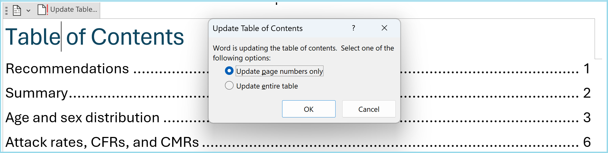

```{=html}
<style>
  h1:not(.title) {
    background-color: #b4e1f0;
    border-radius: 5px;
  }
</style>
```

*This guide was written by Applied Epi. Feedback and suggestions are
welcome at the [GitHub issues
page](https://github.com/R4EPI/sitrep/issues/)*

# Introduction

## Purpose of this guide

This guide accompanies the **AJS outbreak report** .Rmd file, which
can be used to create an automated outbreak report for AJS.

## Who this guide is for

This guide and the sitrep code is intended for **individuals who already
have some familiarity with R** but want ready-made code to make the report
production process faster. You need to be able to edit and troubleshoot
code.

## Outbreak report contents

The report will contain basic information on person, place, and time,
specifically:

-   An overall epi summary with bullet points and epicurve
-   Age and sex distribution
-   Attack rates and case fatality ratios by age group and geographical
    areas
-   Distribution of key groups: pregnant and post-partum women, and IDP/refugees
-   Vaccination history
-   Test results
-   Maps and more detailed geographical breakdowns

# Instructions

## Structure of the outbreak report Rmd

The outbreak report Rmd is split up into sections with chunks which
relate to:

1)  Report set-up including package installation and setting definitions
2)  Importing data
3)  Cleaning data including standardising categorical values, removing
    illogical values, removing unnecessary rows and columns, and
    creating columns needed for analysis
4)  Analysis

Only the outputs from the fourth section on analysis will be visible in
the report when rendering it.

Note there are comments throughout the Rmd file which refer to the
relevant sections in this guide. The comments look like this:

```         
<!-- ~~~~~~~~~~~~~~~~~~~~~~~~~~~~~~~~~~~~~~~~~~~~~~~~~~~~~   
Comments are shown in the code between these special lines  They will not appear in the report output   
~~~~~~~~~~~~~~~~~~~~~~~~~~~~~~~~~~~~~~~~~~~~~~~~~~~~~~~~ -->
```

## How to produce the report

With the help of this guide (specifically section 3), you should produce
the report via the following steps:

1)  **Go through the outbreak template .Rmd in detail and make edits as
    needed**. Make sure you **run the code within chunks and inspect the
    data as you go**, to make sure you correctly and appropriately edit
    the code. There are several sections where code edits are required
    (highlighted in this guide in
    [yellow]{style="background-color:#FFC04D"}) or expected (highlighted
    in this guide in [green]{style="background-color:#c6f3a6"}):
    A)  ⚠️[Required:]{style="background-color:#FFC04D"} **The YAML**, to
        specify the title, location, MSF office, and date of report.
    B)  ⚠️[Required:]{style="background-color:#FFC04D"} **The
        `definitions` chunk**, to correctly define the reporting date
        and other key objects. Make sure the date here matches the one
        in the YAML.
    C)  ⚠️[Required:]{style="background-color:#FFC04D"} **The data
        import section**, to import the correct data
    D)  ⚠️[Required:]{style="background-color:#FFC04D"} **The
        recommendations chunk,** to add text based on the results.
    E)  ⚠️[Expected:]{style="background-color:#c6f3a6"} **The various
        data cleaning chunks**, to ensure that data is appropriate for
        the report.
    F)  ⚠️[Expected:]{style="background-color:#c6f3a6"} **The analysis
        chunks**, to ensure the analysis or presentation is appropriate
        for the data. In particular:
        i)  Make sure you use the **correct date for epicurves and other
            temporal analyses**. The default uses a column that
            prioritises onset date if available and substitutes with
            notification date if onset is not available. It may be more
            appropriate to use only onset date or only notification
            date, depending on your data e.g. completeness and
            reliability of both.
        ii) Ensure that **missing values are correctly used.** The
            default is that "Unknown" or missing (NA) values are
            presented as "[Missing]" in tables and are excluded from
            denominators.
        iii) Ensure the **correct geography columns** are being used.
             The data has three levels (adm1, adm2, and adm3). By
             default, most geographical breakdowns in this report
             (tables and maps) use adm2 level, there is a detailed table
             for cases by adm3 level at the end, and adm1 is not used.
        iv) **Adjust the map legend** as needed so that the categories
            are appropriate (explained further in relevant section)
        v)  **Adjust other presentation features**, such as column
            widths in tables, the space between date labels in the
            epicurve x axis, or the `fig.height` option in chunk labels
            to change the height of figures.
2)  **When you are happy with the Rmd code, click "knit" at the top**,
    which will produce the outbreak report.
3)  **Take extra steps in MS Word to activate the table of contents:**
    When opening the produced word document, click "Yes" in the popup
    asking "Do you want to update the fields in this document?". Then
    click on "Update Table..." at the top left of the table of contents
    and update the page numbers, so that they accurately represent the
    location of each section. See below:

{width="85%"}

## Requirements for report generation

You will need:

-   A AJS linelist, with the following requirements:
    -   One row per case
    -   Information on: sex, age, geographic location, date of
        notification, symptom onset date, vaccination status, outcome, 
        malnutrition level, pregnancy, post-partum, and refugee/IDP status
    -   Column names and categorical values that align with the MSF
        intersectional linelist
-   Population data for age groups and geographic areas of interest, if
    you want to create the case rates per area.

**If you need to change your data into this format, do so with the
outbreak report recode Rmd file first**

# Detailed guide

::: {style="background-color: #edf3f5;  border-radius: 5px;"}
## YAML

At the very top of the Rmd file, make sure you specify the following by
changing the "XXX" content within the quotations marks: - The title
(default is "AJS outbreak report") - The location/area that the
outbreak report concerns - The MSF office - The date of the report

Make sure you do not remove the quotation marks or make edits outside of
the quotation marks.

## Set up and load data

### `setup` chunk

⚠️ [You will need to edit this
chunk]{style="background-color: #FFC04D;"}.

This chunk first sets up key preferences for this R Markdown file, in
`opts_chunk$set()`. By default it is set to not show code, to show
errors, or warning messages in the output.

This chunk also installs/loads packages. Several packages are required
for different aspects of analysis with R. You will need to install these
before starting.

### `definitions` chunk

⚠️ [You will need to edit this
chunk]{style="background-color: #FFC04D;"}.

This chunk is for inputting information so that the report is suited to
this dataset.

1)  Set what the three geographical objects `adm1_residence_name`,
    `adm2_residence_name`, `adm3_residence_name`, mean. For example,
    they may represent the province, district, and village of each case
    respectively, but this will differ depending on the data.

2)  Set the date of the report, assuming the report is updated on a
    weekly basis.

    A)  Provide the actual date of report in YYYY-MM-DD format.
    B)  Edit the `yearweek` function if necessary, so that it correctly
        defines the week that this sitrep is reporting on, e.g. "2024
        W52". The default argument for week start inside `yearweek` is
        1, which means it assumes reporting weeks start on Mondays. You
        can change it to 2 for Tuesday, 3 for Wednesday etc.

### `set_plot_defaults` chunk

This code set the defaults for epicurve plots, such as the base text
size, the text angle, legend title, gridline color (grey), and x and y
labels. It also standardises the labels of epicurves.

## Import data

### `read_population_data` chunk

⚠️ [You will need to edit this
chunk]{style="background-color: #FFC04D;"}.

This report template uses population data to calculate attack rates.

This chunk creates two objects that are used later in the code:

-   **population_data_age**
-   **population_data_adm2** \*

For each object, there are three options to create these objects:

1)  If you have files that contain denominator information, read them in
    (note the code is reading in excel files as default)
2)  If you have counts per subgroup, use the `gen_population()` function
    from the `{sitrep}` package to combine into a table.
3)  If you have the total populations and population distributions, use
    the `gen_population()` function to generate sub-group specific
    counts.

Comment out or delete the options you are not using, and edit the one
you will use.

\* Note this is for calculating rates for the adm2 level. If you need rates for adm1 or adm3 geographic levels, load the relevant population data in the appropriate way, and change the object name for clarity (e.g. to `population_data_adm3`), or create an additional appropriately named denominator data objects.

### `read_data` chunk

⚠️ [You will need to edit this
chunk]{style="background-color: #FFC04D;"}.

This chunk loads linelist data into RStudio. There are seven options you
can pick between to load data. Delete or comment out the code that you
do not need, and edit the code you do need by specifying the correct
file name and location:

1)  Load an example clean linelist in intersectional data format using
    the `gen_data()` function from the `{sitrep}` package. Do this if
    you want to see what the clean data should look like, or if you want
    to test the outbreak template
2)  Load data from an excel file within a specific sheet
3)  Load data from an excel file with macros (this requires read_excel)
4)  Load data from an excel file with a particular range of cells
5)  Load data from an excel file within a particular sheet but also with
    a password. Note this needs the installation of some additional
    packages
6)  Load data from a csv file
7)  Load data from a stata file

### `browse_data` chunk

You'll want to look at your data.

This chunk shows you a few ways you can explore, including printing out
a table which shows all values in your columns (excluding the case ID or
health facility IDs which would be too many to tabulate) so that you can
identify non-standardised or incorrect values.

It is recommended you check other detail more comprehensively as well.

Note that these tables will not be printed when you run the report.

## Clean linelist data

All your cleaning and variable creation should happen in these chunks:

| Step | Description |
|------------------------------------|------------------------------------|
| `standardise_dates` | Sets up and cleans dates, and creates new columns on reporting weeks. This includes creating a **new data_combined column** which prioritises onset date and uses notification date if onset date is not available |
| `create_age_group` | Creates the age group column from age (and some intermediary columns). For AJS, two age group columns are created for a choice of table outputs in the analysis section |
| `standardise_values` | Cleans the values of categorical variables (e.g., typo correction) and removes illogical values. |
| `create_vars` | Creates additional columns based on other columns, and converts categorical columns into ordered factors so that all values are presented in the correct order in table outputs |
| `duplicates` | Removes duplicate rows. |
| `remove_unused_data` | Removes rows (and columns) that are not required for analysis. |
| `save_cleaned_data` | Saves the clean data as a back-up. |

⚠️ [You will likely need to edit some of these
chunks]{style="background-color: #c6f3a6;"}.

### `standardise_dates` chunk

As the data should already be in the right format, you should not need
to change this section. If you have imported an RDS file, this code
might not be needed, but it will be useful for excel files and csv files
etc.

The code does the following:

1)  Changes all columns starting with the word 'date' (i.e. the
    `date_notification`, `date_symptom_start`, and
    `date_hospitalisation_end` columns) to be recognised as dates by R.
    The function `ymd` is used to recognise that the text has dates
    written in the order of year, month, and day (e.g. 2025-02-01 or
    2025 Feb 01 or 2025 February 1). ⚠️ [Change this if the dates are
    written in a different way in your
    data]{style="background-color: #c6f3a6;"}, e.g. to `dmy()` if
    written in day, month, year (e.g. 01-02-2025 or 1 Feb 2025)

2)  Fixes logical inconsistent dates: removed symptom onset dates if
    they are after notification dates. ⚠️ [Inspect and edit data if you
    can, or change the rule to fit the circumstances of your
    data]{style="background-color: #c6f3a6;"}

3)  Creates a new date column, `date_combined`, to maximise date
    completeness, by using the `coalesce()` function that prioritises
    symptom onset date, and substitutes with notification date if onset
    date is not available. It also creates a `date_source` column to
    label if the value in the `date_combined` column is the onset date
    or the notification date.

4)  Creates six new week columns:

    -   `epiweek_symptom_start_num`, `epiweek_notification_num`, and
        `epiweek_combined_num`: These are week representations of the
        onset date, notification date, and `date_combined` columns, and
        are represented with the year and the week number, e.g. "2025
        W10". It uses the `yearweek` function in which you state which
        day the week starts (default 1 for Monday). These are not the
        default columns used in epicurves but these can be switched to.

-   `epiweek_symptom_start`, `epiweek_notification`, and
    `epiweek_combined`: This will create corresponding columns with the
    date representing the start of the week, e.g. "2025-03-03". Note the
    selected date will depend on the start day provided in the
    `yearweek` function.

### `create_age_group` chunk

This chunk creates a categorical variable for age groups, as typically analysed for the disease. 

### `standardise_values` chunk

Edit the code as needed to make sure values are standardised and
correct. The checks you did in the `browse_data` chunk will inform this
section.

Two examples are provided to start with: 

- Correct geographical values: The template shows the correction of the adm2_residence column, first by standardizing the capitalization, and then specifying which typos should be corrected to which values. 
- Changing all "Unknown" and "" values to NA (recognised as missing by R), across all character columns. This is so that these values are not included in the denominator for analyses looking at percentage distributions. ⚠️[Consider changing or removing this if you want to handle unknown values
differently]{style="background-color: #c6f3a6;"}

This template does not include code for all possible errors as this will
depend on your data, so you may need to write your own code/consult
someone who can write code in R to make sure your linelist data is fully
ready for analysis.

### `create_vars` chunk

This chunk creates other columns used in analysis, and converts
categorical columns into a factor class so that all categories are
displayed in the correct order in tables later in the analysis. You can
edit this section for more columns.

New columns are: 

- `died`: binary (TRUE/FALSE) column labeling if a case died or not.
- `vacci_HEV_doses`: categorical column labeling if a person received 1, 2, or 3 doses, based on the three columns `vacci_HEV_dose1`, `vacci_HEV_dose2`, and `vacci_HEV_dose3`. The code follows these rules:
    - "3 doses" = all three columns are "Yes"
    - "2 doses" = dose1 and dose2 are "Yes"
    - "1 dose" = only dose1 is "Yes"
    - "0 doses" = dose1 is "No", and doses 2/3 are "No" or NA
    - NA = all 3 columns are missing
    - "Unclear" = all other combinations (e.g., dose1 = "No", but dose2 = "Yes")

These columns are changed into factors. **Note that values not specified as valid categories in the code will be converted to NA**: 

- `HEV_RT_result` 
- `status` 
- `outcome` 
- `date_source`

### `duplicates` chunk

This chunk removes duplicate cases, presenting two options. You can edit
to use whichever unique identifiers you think relevant.

-   Option 1 simply keeps the first occurrence of a duplicated case
    based on case_number, sex and age_group. In the default template,
    the deduplication removes repeat rows for an individual with the
    same case_id, sex_id, and age_group.
-   Option 2 gives you the ability to create a TRUE/FALSE variable to
    flag rows that are duplicated - giving you more flexibility around
    browsing which ones to drop.

### `remove_unused_data` chunk

This step filters out data that are not appropriate to include in the
analysis, for instance:

-   Data with onset after the reporting week: This removes cases that
    are not feasible for this report

-   Other ineligible/anomalous data: E.g. you might want to remove rows
    with missing essential data. Use this section to make other edits as
    needed (please do not change column names or formats).

### `save_cleaned_data` chunk

You can save your cleaned dataset as an RDS to keep the correct
class/format for all columns. The template code automatically names your
file "linelist_cleaned_DATE", where DATE is the current date. Uncomment
this code to use it.

## Analysis

### Recommendations text

⚠️ [You will need to edit this section either in the code or final
output]{style="background-color: #FFC04D;"}.

This is a placeholder section for you to add comments in consultation
with the appropriate team/expertise.

### Summary text

At the start of the epi description, there are some short bullet points
describing the number of cases and key epi points.

### `epicurve` chunk

This chunk starts by creating the objects `all_weeks` and `all_weeks_date` with all weeks, spanning from the earliest `epiweek_combined` value to the `reporting_date`. This is used across epicurves in this report to define the range in the x axis.


Then the epicurve is created using the coalesced column
`epiweek_combined`. The source of the date is indicated by the fill
colour of the bars, based on the `date_source` column. Note that the
title of this epicurve specifies onset date, so this analysis and code
assumes that the `epiweek_combined` column is indeed mostly onset date
and only sometimes approximated by notification date. ⚠️ [Change the
week column used if not
appropriate]{style="background-color: #c6f3a6;"}, e.g. if there is high
missingness in onset date.

Change the `fig.height` chunk option for smaller or larger figures, and
change the `breaks` argument in the `scale_x_date()` function to specify
the time difference between the x axis date labels. For example, you can
specify `breaks = "1 week"` or `breaks = "2 months"`.

### Age and sex distribution

This section produces:

- Bullet points at the top to summarise key points about age and sex distribution
-   In the `total_props_agegroup_sex` chunk, a table showing age distribution overall and by sex 
-   In the `age_pyramid` chunk: a age-sex pyramids using the `age_pyramid()` function, which produces a ggplot object so can be further edited with `{ggplot2}` code if needed (e.g themes, labels, and scales).

### Combined count, attack rate, and case fatality ratio tables

This section calculates total case counts, cases in the last 14 days
(calculated for the 14 days prior to reporting date), deaths, and the CFR. Both attack rate tables link to the populations table imported or produced in the `read_population_data` chunk.

-   The `attack_rate_by_agegroup` chunk creates a table by broad age
    group using the `age_group` column
-   The `attack_rate_by_adm2` chunk creates a table by unique value for
    `adm2_residence`.

### Other case characteristics

The top of this section has in-line code to produce bullet points summarising number of pregnant and post-partum women, and numbers of IDP/refugee cases.

The `vaccination_test` chunk produces a table showing the distribution of vaccine doses from 0 to 4 among cases, and the distribution of rapid test (RT) results.

The `outcomes` chunk produces a table showing the distribution of outcomes, by age group.

### Geographic distribution - tables

Two chunks produce the following:

-   `describe_by_adm2` chunk: A table with geographical breakdowns, for
    the adm2 level, by age group.
-   `epicurve_by_adm2` chunk: This epicurve uses the same code as the
    first main epicurve, with the addition of a `facet_wrap()` function
    to split the code into several mini plots per `adm2` value. You may
    want to edit the figure height and width within the chunk so that it
    fits on the page. As with the main epicurve, you may also want to
    make sure you use the right week column, as this analysis and code
    assumes that the `epiweek_combined` column is mostly onset date and
    only sometimes approximated by notification date. ⚠️ [Change the
    week column used if not
    appropriate]{style="background-color: #c6f3a6;"}, e.g. if there is
    high missingness in onset date.

Note that the meaning of adm2, e.g. District vs Region, should be set in
the `definitions` chunk so that the titles and labels within these
tables and figures are correct.

### Geographic distribution - maps

The report produces three maps to show:

-   Attack rates by adm2
-   Total cases by adm2
-   Cases in last 14 days by adm2

The map production is split up into several chunks:

-   `read_shapefiles`: To create maps, you need to have a shapefile of
    the area (note that a shapefile typically consists of several files,
    of which one ends in .shp). This chunk gives you the option of
    generating a fake shape file with the `gen_polygon` function.
    Otherwise, you can read in the shapefile. Often, the MSF GIS unit
    can provide shapefiles and advice on how to use them.Your shapefile
    can be a polygon or points. Polygons do not need to be contiguous.
    The names of the polygons or points MUST match the names in your
    linelist. Finally, your coordinate reference system needs to be
    WGS84.
-   `chloropleth_map_prep`: This chunk builds on the detailed attack
    rate table produced in the `attack_rate_by_adm2` chunk, by
    converting counts and attack rates into categories suitable for
    mapping. The `find_breaks()` function is used to dynamically define
    the boundaries of the groupings. Edit the `breaks = X` and
    `snap = X` argument to change how many and how wide the subgroups
    are. For example, if there are 5000 total cases, you may want four
    categories (X=4) that snap to the closest 500 (snap=500, for example for categories 0,
    1-1000, 1001-2000, 2001-3000, and 3001+). This chunk also links to
    the `map` object created in the `read_shapefiles` chunk to bring in
    the geometries for mapping. ⚠️ [You will likely need to edit this
    chunk to change the categories that appear on the
    map/legend]{style="background-color: #c6f3a6;"}.
-   `chloropleth_map` chunks: Three chunks create one map each.

### Geographic detail

The `describe_by_adm2_adm3` chunk creates a table showing the
distribution of cases by adm2 and adm3. It has the potential to be a
long table so it is at the end of the report.

The meanings of adm2 and adm3 are set at the top in the `definitions`
chunk, which as default are sets to mean **county** and **locality**
respectively. Go back and change this chunk if the table titles are
incorrect.
:::
